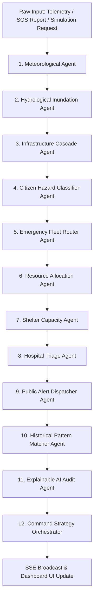
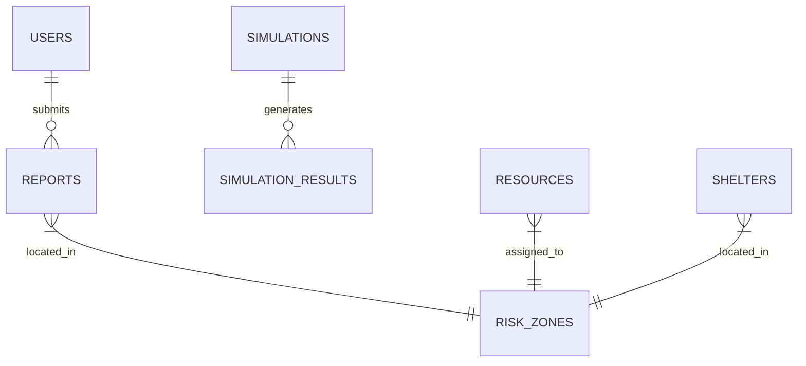

# 🗺️ ResponSync — System Architecture & Codebase Map

> **Reference Document**: Complete codebase blueprint, file dependency matrix, component map, backend endpoints, database schema, and 12-Agent AI orchestration engine for **ResponSync**.

---

## 📌 Executive Summary

**ResponSync** is an AI-powered **Digital Twin for Predictive Disaster Response**, specifically designed for the **Chennai Velachery–Adyar flood corridor** (South India's most vulnerable urban flood basin). It integrates real-time weather data, satellite radar imagery (ESA Sentinel-1 & NASA FIRMS), IoT sensor streams, citizen emergency reports, and a **12-Agent AI Orchestration Pipeline** (powered by Google Gemini GenAI SDK) into a unified command platform.

---

## 🛠️ Technology Stack

| Layer | Technologies |
| :--- | :--- |
| **Frontend UI** | React 19, TypeScript, Vite 6, Tailwind CSS 4, Motion (Framer), Lucide React |
| **Geospatial & Mapping** | Leaflet 1.9, OpenStreetMap / CARTO Basemaps, OSRM (Open Source Routing Machine), PostGIS |
| **Backend Server** | Node.js, Express 4, `tsx` (TypeScript Execution Engine), Server-Sent Events (SSE) |
| **Database & Persistence** | Supabase (PostgreSQL + PostGIS spatial extension) with transparent dual-path in-memory fallback |
| **AI Intelligence** | Google Gemini GenAI SDK (`@google/genai`, model `gemini-2.5-flash`) + Physics & Heuristic Engine Fallback |
| **Notifications** | Firebase Cloud Messaging (FCM), Emergency SMS Gateway Service |
| **Build & Tooling** | `esbuild` (CJS server bundling), Vite (client HMR/bundling), `tsc` (Strict Type Validation) |

---

## 📁 Repository Directory Structure

```
responsesync/
├── .agents/                        # AG Kit Agent & Skill System Directory
│   ├── agent/                      # Specialist AI Agent definitions
│   ├── memory/                     # Persistent cross-session memory (MEMORY.md)
│   ├── rules/                      # System-wide AG Kit rules (code-rules, request-routing, etc.)
│   └── skills/                     # Skill modules (clean-code, frontend-design, etc.)
├── assets/                         # Static project assets & visual documentation
├── docs/                           # Technical documentation & manual feature verification guides
│   └── features/                   # Feature guides (01_digital_twin_map.md to 08_realtime_sse_broadcasts.md)
├── scripts/                        # Utility & maintenance scripts
│   ├── check_supabase.ts           # Supabase connection & schema verification test script
│   └── populate_db.ts              # Database seeder for initial risk zones, shelters, and resources
├── src/                            # Application Source Code
│   ├── App.tsx                     # Top-level React Router / view switcher component
│   ├── main.tsx                    # React 19 root entry point
│   ├── index.css                   # Global styles & Tailwind CSS 4 imports
│   ├── backend/                    # Node.js / Express Server & Microservices
│   │   ├── server.ts               # Primary Express server (32 endpoints, SSE engine, 12-Agent AI pipeline)
│   │   ├── authMiddleware.ts       # JWT authentication & RBAC authorization middleware
│   │   ├── notificationsService.ts # FCM push notification & SMS dispatch handlers
│   │   └── satelliteService.ts     # ESA Sentinel-1 SAR & NASA FIRMS satellite data integration
│   ├── dashboard/                  # Command Platform & Emergency Dashboards
│   │   ├── DashboardApp.tsx        # Central Dashboard layout container & tab manager
│   │   └── components/             # UI Components & Interactive Modules
│   │       ├── AlertNotificationBanner.tsx # Live emergency alert bar
│   │       ├── AnalyticsHub.tsx            # Real-time resource & incident analytics charts
│   │       ├── AuthorityDashboard.tsx      # Emergency HQ decision center & dispatch control
│   │       ├── CascadingImpactView.tsx     # 12-Agent cascading failure simulation matrix
│   │       ├── CitizenPortal.tsx           # Citizen SOS report submission & track status
│   │       ├── DashboardOverview.tsx       # System overview & live metrics grid
│   │       ├── DigitalTwinMap.tsx          # Leaflet GIS map with basemaps, measuring & routing
│   │       ├── ExplainabilityModal.tsx     # AI decision rationale modal (XAI transparent audit)
│   │       ├── Header.tsx                  # App navbar, role switcher & SSE connection status
│   │       ├── HospitalsPanel.tsx          # Hospital bed & ICU capacity monitor
│   │       ├── IncidentsPanel.tsx          # Citizen report list & verification control
│   │       ├── ResourceDispatchModal.tsx   # Fleet dispatch dialog
│   │       ├── ResourcesPanel.tsx          # Emergency fleet & equipment status
│   │       ├── SettingsPanel.tsx           # System preferences & API key configuration
│   │       ├── SheltersPanel.tsx           # Relief shelter capacity & occupancy tracker
│   │       └── SimulationStudio.tsx        # Disaster what-if physics simulation sandbox
│   ├── hooks/                      # Custom React Hooks
│   │   ├── useEvacuationRoute.ts   # OSRM evacuation path calculation hook
│   │   └── useSSEStream.ts         # Real-time SSE connection & event dispatcher hook
│   ├── landing/                    # Public Landing Page
│   │   └── LandingPage.tsx         # Hero section, feature overview & portal navigation links
│   └── shared/                     # Types, Mock Data & Constants
│       ├── cascadingData.ts        # Pre-computed cascading failure scenarios & graph nodes
│       ├── cascadingTypes.ts       # Type definitions for cascading impact analysis
│       ├── mockDigitalTwinData.ts  # Fallback Chennai geospatial data (zones, shelters, routes)
│       └── types.ts                # Primary TypeScript interfaces (User, Report, Shelter, etc.)
├── .env                            # Environment configuration (secrets & local API keys)
├── .env.example                    # Template environment variables
├── .gitignore                      # Git ignore patterns
├── CODEBASE.md                     # [THIS FILE] Codebase architecture & reference guide
├── README.md                       # Main project documentation & GitHub README
├── index.html                      # SPA HTML shell
├── package.json                    # Dependencies & npm build scripts
├── supabase_schema.sql             # Supabase PostgreSQL + PostGIS DDL schema script
├── tsconfig.json                   # TypeScript compiler configuration
└── vite.config.ts                  # Vite build tool configuration
```

---

## 🤖 12-Agent AI Orchestration Pipeline

The AI engine in `src/backend/server.ts` orchestrates 12 dedicated specialist agents using Google Gemini (`gemini-2.5-flash`) with a fail-safe physics/heuristic engine fallback:



### Agent Roles & Descriptions

| # | Agent Name | Function & Responsibility | Primary Output |
| :-: | :--- | :--- | :--- |
| **1** | **Meteorological Agent** | Analyzes rainfall intensity (mm/hr), wind, and high-tide status | Preprocessing threat level |
| **2** | **Hydrological Inundation Agent** | Calculates water depth, inundation spread rate & time horizon | 30m / 1h / 3h depth projections |
| **3** | **Infrastructure Cascade Agent** | Evaluates power grid, subway, and road blockage risks | Node failure propagation |
| **4** | **Citizen Hazard Classifier Agent** | Validates incoming citizen reports, detects spam, assigns severity | Report score & hazard tag |
| **5** | **Emergency Fleet Router Agent** | Computes safe evacuation detours avoiding submerged roads | Safe OSRM coordinates |
| **6** | **Resource Allocation Agent** | Optimizes rescue boat, pump, ambulance, and bus assignments | Dispatch recommendation |
| **7** | **Shelter Capacity Agent** | Tracks relief camp occupancy, food, and medical stock | Shelter re-routing recommendation |
| **8** | **Hospital Triage Agent** | Monitors ICU bed availability & emergency medical capacity | Hospital diversion guidance |
| **9** | **Public Alert Dispatcher Agent** | Drafts multilingual citizen warnings & FCM/SMS alerts | Alert payload & advisory text |
| **10**| **Historical Pattern Matcher Agent** | Matches current flood parameters with 2015/2021/2023 disaster logs | Similarity index & lessons learned |
| **11**| **Explainable AI Audit Agent** | Generates human-readable rationale & confidence breakdown | Transparency report |
| **12**| **Command Strategy Orchestrator** | Synthesizes outputs into single actionable HQ command plan | Master response strategy |

---

## ⚡ Server API Endpoints Reference (`src/backend/server.ts`)

| Category | Endpoint | Method | Auth / Role | Description |
| :--- | :--- | :---: | :---: | :--- |
| **System** | `/api/health` | GET | None | Health check & system component status |
| **Events** | `/api/events` | GET | None | Real-Time Server-Sent Events (SSE) stream |
| **Auth** | `/api/auth/login` | POST | None | Authenticates user & issues JWT token |
| **Auth** | `/api/auth/me` | GET | JWT | Retrieves current logged-in user profile |
| **Auth** | `/api/auth/switch-role` | POST | None | Fast role-switching endpoint for demo/testing |
| **Notifications** | `/api/notifications/fcm/register` | POST | None | Registers device FCM push notification token |
| **Notifications** | `/api/notifications/fcm/send` | POST | Admin/Auth | Sends FCM push notification broadcast |
| **Notifications** | `/api/notifications/sms/send` | POST | Admin/Auth | Dispatches emergency SMS to affected citizens |
| **Notifications** | `/api/notifications/history` | GET | None | Retrieves notification dispatch logs |
| **Satellite GIS** | `/api/gis/satellite/sentinel-sar` | GET | None | Fetches Sentinel-1 Synthetic Aperture Radar data |
| **Satellite GIS** | `/api/gis/satellite/nasa-firms` | GET | None | Fetches NASA FIRMS thermal/hotspot overlay data |
| **Satellite GIS** | `/api/gis/satellite/metadata` | GET | None | Satellite pass timestamps and resolution details |
| **Environment** | `/api/weather` | GET | None | Live Open-Meteo rainfall & tide cache |
| **Environment** | `/api/risk` | GET | None | Risk level breakdown for Velachery flood zones |
| **Resources** | `/api/resources` | GET | None | Retrieves emergency fleet & response equipment |
| **Resources** | `/api/recommendations` | GET | None | Active AI action recommendations for HQ |
| **AI Routing** | `/api/ai/evacuation-route` | POST | None | Calculates safe evacuation path using OSRM |
| **AI Cascade** | `/api/ai/cascading-impact` | POST | None | Runs 12-Agent cascading failure analysis |
| **Reports** | `/api/reports` | GET | None | Lists citizen SOS reports |
| **Reports** | `/api/reports` | POST | None | Submits new citizen SOS report |
| **Shelters** | `/api/shelters` | GET | None | Retrieves relief shelter status & occupancy |
| **Knowledge** | `/api/decision-knowledge` | GET | None | Queries historical 2015–2023 disaster memory |
| **Simulation** | `/api/simulations` | GET | None | Lists historical & active simulation runs |
| **Simulation** | `/api/simulation/:id` | GET | None | Retrieves detailed simulation record |
| **AI Engine** | `/api/ai/scenario-match` | POST | None | Matches current telemetry against past disasters |
| **AI Engine** | `/api/ai/multiagent-run` | POST | None | Executes complete 12-Agent orchestration pipeline |
| **AI Engine** | `/api/ai/simulate` | POST | None | Runs custom What-If disaster scenario simulation |
| **AI Engine** | `/api/ai/validate-report` | POST | None | AI validation & spam detection for SOS reports |
| **AI Engine** | `/api/ai/explain-decision` | POST | None | Generates XAI rationale for authority decisions |

---

## 🗄️ Database Architecture (`supabase_schema.sql`)

PostgreSQL database schema optimized with PostGIS spatial extension:



### Table Definitions Summary

1. **`users`**: RBAC user accounts (`authority`, `responder`, `citizen`, `admin`).
2. **`reports`**: Citizen SOS hazard reports with PostGIS Point geometry (`GEOMETRY(Point, 4326)`).
3. **`weather_cache`**: Hydro-meteorological readings (rainfall rate, tide status, temperature).
4. **`risk_zones`**: Inundation zones with PostGIS Polygon geometry, population at risk, and water depth projections.
5. **`simulations`**: Logs of What-If physics simulations with dam discharge and canal blockage factors.
6. **`decision_knowledge`**: Disaster memory base (2015 Chennai floods, 2021 Cyclone Nivar, 2023 Cyclone Michaung).
7. **`resources`**: Emergency fleet vehicles (rescue boats, dewatering pumps, ambulances, evacuation buses).
8. **`shelters`**: Relief camps with total capacity, current occupancy, and medical/food supply status.
9. **`hospitals`**: Healthcare facilities with bed, ventilator, and ICU availability tracking.
10. **`evacuation_routes`**: Stored safe evacuation waypoints and safety scores.

---

## 🔗 File Dependency Matrix

When modifying any key component, consult this import dependency map:

| File | Depends On (Imports) | Dependent Files (Imported By) |
| :--- | :--- | :--- |
| `src/App.tsx` | `DashboardApp.tsx`, `LandingPage.tsx`, `Header.tsx`, `AlertNotificationBanner.tsx` | `src/main.tsx` |
| `src/dashboard/DashboardApp.tsx` | All `src/dashboard/components/*`, `useSSEStream.ts`, `shared/types.ts` | `src/App.tsx` |
| `src/dashboard/components/DigitalTwinMap.tsx` | `leaflet`, `lucide-react`, `useEvacuationRoute.ts`, `shared/types.ts` | `DashboardApp.tsx` |
| `src/backend/server.ts` | `authMiddleware.ts`, `notificationsService.ts`, `satelliteService.ts`, `@google/genai`, `@supabase/supabase-js` | Executed directly via `npm run dev` / `tsx` |
| `src/hooks/useSSEStream.ts` | React (`useEffect`, `useState`, `useRef`), `shared/types.ts` | `DashboardApp.tsx`, `Header.tsx` |
| `src/hooks/useEvacuationRoute.ts` | React (`useState`, `useCallback`) | `DigitalTwinMap.tsx` |

---

## 🔑 Environment Variables (`.env`)

| Key | Description | Fallback Behavior |
| :--- | :--- | :--- |
| `GEMINI_API_KEY` | Google Gemini API key (`gemini-2.5-flash`) | Uses internal Physics & Heuristic Engine fallback |
| `SUPABASE_URL` | Supabase PostgreSQL project URL | Uses in-memory storage cache |
| `SUPABASE_ANON_KEY` | Supabase public API key | Uses in-memory storage cache |
| `JWT_SECRET` | Secret key for signing JWT tokens | Uses default secure fallback key |
| `PORT` | Server listening port | Defaults to `3000` |
| `NODE_ENV` | Application environment (`development` / `production`) | Defaults to `development` |

---

## ⚙️ Development & Operational Commands

```bash
# Run local development server (Express backend + Vite HMR frontend)
npm run dev

# Strict TypeScript type check (no code generation)
npm run lint

# Build production bundle (Vite client + esbuild CJS server)
npm run build

# Start production server
npm run start

# Verify Supabase database connectivity & tables
npx tsx scripts/check_supabase.ts

# Populate Supabase database with initial seed data
npx tsx scripts/populate_db.ts
```

---

<div align="center">
  <p><strong>ResponSync — Project Codebase Map</strong> • Maintained for AG Kit & Developer Reference</p>
</div>
