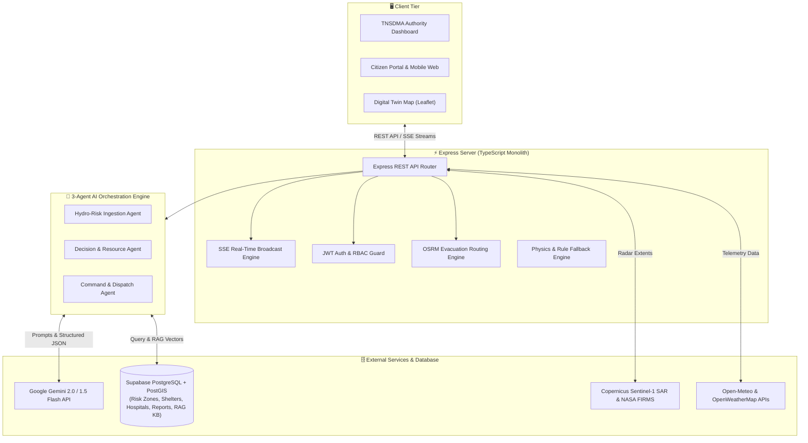
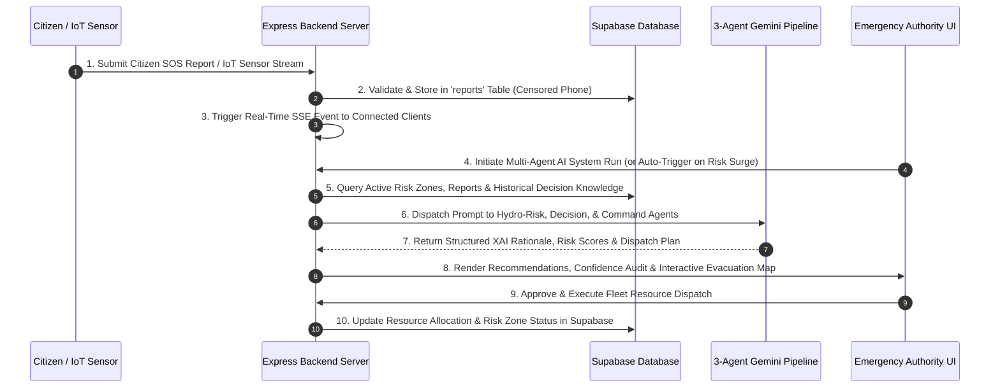

# ResponSync ⚡
> **AI-Powered Digital Twin for Predictive Disaster Response**

ResponSync is an autonomous, full-stack **AI Decision Digital Twin** — a live virtual city representation that fuses real-time weather, IoT sensor telemetry, satellite radar, citizen reports, and explainable multi-agent AI into a unified command platform for predictive flood response.

The platform is purpose-built for the **Chennai Velachery–Adyar flood corridor**, the most flood-prone urban region in South India. It combines a 3-agent AI orchestration pipeline (powered by Google Gemini) with real-time geospatial intelligence to autonomously assess threats, simulate cascading impacts, optimize evacuation routes, and dispatch emergency resources.
 
<a href="https://responsesync.ai.studio/
">https://responsesync.ai.studio/
</a> 
 <a href=""></a> 
---

## 👥 Team Details & Project Metadata

- **Project Name:** ResponSync
- **Target Region:** Chennai Velachery & Adyar Corridor (Velachery South, Guindy Railway Subway, Kotturpuram Adyar River Bank, Taramani 100ft Canal Link, Madipakkam Lake Basin)
- **Repository:** [https://github.com/goprocker/ResponseSync](https://github.com/goprocker/ResponseSync)

### 👨‍💻 Team Members

| # | Name | Role / Focus Area | GitHub Profile |
|:-:|---|---|---|
| 1 | **GOPINATH R** | Team Lead & Frontend Engineering | [@goprocker](https://github.com/goprocker) |
| 2 | **MEDA VENKATA SAI CHARAN** | Backend Infrastructure & API Services | [@NINJA981](https://github.com/NINJA981) |
| 3 | **ANANYA HARISH** | Disaster Simulations Engine & Physics | [@ananyadharish](https://github.com/ananyadharish) |
| 4 | **GOPI K** | Database Schemas & Supabase PostGIS | [@K-Gopi2007](https://github.com/K-Gopi2007) |
| 5 | **SHIVANI SK** | Research & Development (R&D) | [@shivaniisk](https://github.com/shivaniisk) |

---

## ❓ Problem Statement & Solution

### 🔴 The Problem
Urban flooding in coastal metropolises like Chennai results in catastrophic losses of life, infrastructure destruction, and delayed relief dispatch:
- **Inflexible Static Operations:** Traditional emergency operations rely on manual reports and reactive dispatch after inundation has already occurred.
- **Unpredictable Cascading Outages:** Waterlogging at critical nodes (e.g., Guindy Railway Subway) cascades into hospital power grid blackouts, stranded ambulances, and shelter overcapacity within minutes.
- **Data Fragmentation:** Meteorological forecasts, citizen emergency calls, satellite imagery, and municipal resource trackers operate in isolated silos.
- **Black-Box AI Distrust:** Emergency coordinators hesitate to trust automated AI dispatches without clear, verifiable explanations for high-stakes decisions.

### 🟢 The Solution: ResponSync
ResponSync bridges data silos and automates response planning through a real-time **Digital Twin & 3-Agent AI System**:
1. **Live City Simulation:** Continuously models water levels, IoT sensor streams, river discharges, and citizen reports on a Leaflet spatial map.
2. **Autonomous Multi-Agent AI:** Uses specialized Gemini AI agents to ingest data, execute RAG historical scenario matching, formulate resource dispatch plans, and audit decision safety.
3. **Transparent Explainable AI (XAI):** Provides human-in-the-loop coordinators with complete reasoning chains, supporting evidence, confidence scores, and alternative risk analysis before dispatch execution.

---

## ✨ Key Features

- **🗺️ Interactive Digital Twin Map:** Live Leaflet visualization of city risk zones with dynamic risk-score shading, IoT sensor telemetry, relief shelters, hospitals, emergency resource fleets, and citizen hazard pins.
- **🤖 3-Agent AI Orchestration Pipeline:**
  - *Hydro-Risk Ingestion Agent:* Processes weather radar, IoT water depth gauges, river discharge, and citizen reports to calculate short-term inundation rates.
  - *Decision & Resource Agent:* Runs vector similarity matching against historical Chennai flood events (2015, 2021, 2023) to formulate resource allocation and safe detours.
  - *Command & Dispatch Agent:* Performs XAI audits, calculates confidence scores, and generates multi-agency dispatch orders.
- **🌊 What-If Disaster Simulation Studio:** Interactive physics engine to simulate flood, cyclone, earthquake, wildfire, landslide, and tsunami scenarios with real-time controls for rain rate, dam discharge, high tide overlap, and canal blockages.
- **🔍 Historical Scenario Retrieval (RAG):** Matches current conditions against a Supabase vector knowledge base of historical Chennai disasters to extract proven mitigation strategies.
- **💬 Explainable AI (XAI) Modal:** Full breakdown of AI recommendations, showing core reasoning, supporting sensor evidence, risk metrics, and trade-off analysis.
- **🚨 Citizen Emergency Reporting Portal:** Allows citizens to submit geo-tagged hazard reports (waterlogging, trapped citizens, road blockages) with AI validation scoring and masked PII protection.
- **📡 Satellite Intelligence Feeds:** Integration with Copernicus Sentinel-1 Synthetic Aperture Radar (SAR) and NASA FIRMS thermal anomaly imagery for real-time flood perimeter mapping.
- **⚡ Server-Sent Events (SSE) Real-Time Engine:** Live streaming updates for citizen reports, agent activity logs, automated agency alerts, and resource status.
- **🛣️ Flood-Aware OSRM Evacuation Engine:** Dynamic street routing engine avoiding submerged subways and sluice breaches, returning safe waypoints and turn-by-turn guidance.
- **🔒 Privacy & Security:** Censored PII (masked phone numbers `+91 98401 XXXX`), JWT authentication, role-based access control (RBAC), and strict parameter scoping.

---

## 💻 Tech Stack

| Category | Technology |
|---|---|
| **Frontend Framework** | React 19, Vite 6, TypeScript |
| **Styling & Icons** | Vanilla CSS, Tailwind CSS v4, Lucide React, Motion (Framer) |
| **Geospatial & Mapping** | Leaflet, React-Leaflet, OSRM (Open Source Routing Machine), Turf.js |
| **Backend Runtime** | Node.js (v24), Express 4 (TypeScript) |
| **Database & ORM** | Supabase (PostgreSQL), PostGIS spatial extensions |
| **AI / LLM Integration** | Google Gemini API (`@google/genai`), RAG Vector Similarity Matching |
| **Real-time Engine** | Server-Sent Events (SSE) Broadcast Stream |
| **Telemetry & Weather APIs** | Open-Meteo Weather & Flood Hydro-API, OpenWeatherMap API |
| **Satellite GIS** | ESA Sentinel-1 SAR, NASA FIRMS |
| **Authentication & Security** | JWT (JSON Web Tokens), RBAC, Dotenv, HTTPS/TLS |

---

## 🏗️ System Architecture



---

## 🔄 Detailed System Workflow



---

## 📁 Folder Structure

```
responsesync/
├── .agents/                      # Custom Agent Kit & System Rules
│   ├── agent/                    # Specialist agent definitions
│   ├── memory/                   # Cross-session MEMORY.md index
│   ├── rules/                    # Core conventions & AGENTS.md rules
│   ├── skills/                   # Modular skills (frontend-design, clean-code, etc.)
│   └── workflows/                # Interactive slash command workflows
├── docs/                         # Feature documentation & specifications
│   └── features/                 # Modular feature breakdowns
├── scripts/                      # Database & setup utility scripts
│   ├── check_supabase.ts         # Supabase verification & table count audit script
│   └── populate_db.ts            # Detailed database seeding script (Zero-hallucination data)
├── src/                          # Application source code
│   ├── App.tsx                   # Main React root & routing setup
│   ├── main.tsx                  # React DOM entrypoint
│   ├── index.css                 # Base design system & Tailwind styling
│   ├── backend/                  # Server-side modules
│   │   ├── authMiddleware.ts     # JWT authentication & RBAC middleware
│   │   ├── notificationsService.ts # FCM push & SMS gateway handlers
│   │   ├── satelliteService.ts   # Sentinel-1 SAR & NASA FIRMS GIS feed handlers
│   │   └── server.ts             # Express server, API endpoints & SSE broadcast engine
│   ├── dashboard/                # Command Center UI Components
│   │   ├── DashboardApp.tsx      # Main Dashboard container & global state
│   │   └── components/           # Sub-panels (Map, Overview, Hospitals, Shelters, etc.)
│   │       ├── AnalyticsHub.tsx
│   │       ├── AuthorityDashboard.tsx
│   │       ├── CitizenPortal.tsx
│   │       ├── DashboardOverview.tsx
│   │       ├── DigitalTwinMap.tsx
│   │       ├── ExplainabilityModal.tsx
│   │       ├── HospitalsPanel.tsx
│   │       ├── IncidentsPanel.tsx
│   │       ├── ResourcesPanel.tsx
│   │       ├── SheltersPanel.tsx
│   │       └── SimulationStudio.tsx
│   ├── landing/                  # Landing page & agency portal selection
│   │   └── LandingPage.tsx
│   ├── services/                 # API service Layer
│   │   ├── api.ts                # Frontend REST API client
│   │   └── schema.ts             # Zod validation schemas
│   └── shared/                   # Shared types & mock data fallbacks
│       ├── mockDigitalTwinData.ts # Initial fallback datasets with censored PII
│       └── types.ts              # TypeScript interface definitions
├── .env.example                  # Environment variable configuration template
├── package.json                  # Dependencies & npm scripts
├── supabase_schema.sql           # PostGIS SQL schema definition
├── tsconfig.json                 # TypeScript compiler configuration
└── vite.config.ts                # Vite bundler configuration
```

---

## ⚙️ Installation & Usage Guide

### Prerequisites
- **Node.js**: v18.0.0 or higher (v24 recommended)
- **npm** or **bun**: v9.0.0 or higher
- **Git**: Installed on system

### Step 1: Clone Repository & Install Dependencies
```bash
git clone https://github.com/goprocker/ResponseSync.git
cd ResponseSync
npm install
```

### Step 2: Configure Environment Variables
Create a `.env` file in the project root:

```env
APP_URL="http://localhost:3000"
ENVIRONMENT="development"
DEBUG=true

# Supabase Credentials
SUPABASE_URL="https://your-supabase-project.supabase.co"
SUPABASE_KEY="your-supabase-anon-key"
SUPABASE_ANON_KEY="your-supabase-anon-key"

# External APIs
OPENWEATHER_API_KEY="your_openweather_api_key"

# AI Integration
GEMINI_API_KEY="your_gemini_api_key"
```

### Step 3: Populate Database
Seed Supabase with detailed Chennai disaster data, hospitals, shelters, resources, and citizen reports:
```bash
npx tsx scripts/populate_db.ts
```
Verify table counts:
```bash
npx tsx scripts/check_supabase.ts
```

### Step 4: Run Development Server
```bash
npm run dev
```
Open your browser at `http://localhost:3000`.

---

## 🗄️ API & Database Documentation

### Database Tables (Supabase + PostGIS)

| Table Name | Primary Key | Description | Key Attributes |
|---|---|---|---|
| `risk_zones` | `id` (TEXT) | City sector risk profiles | `risk_score`, `priority_level`, `predicted_water_level_30m`, `status`, `center_coordinates` |
| `hospitals` | `id` (TEXT) | Emergency hospitals directory | `name`, `total_beds`, `available_icu_beds`, `trauma_center_active`, `status`, `coordinates` |
| `shelters` | `id` (TEXT) | Relief camps & shelters | `name`, `capacity`, `current_occupancy`, `contact_phone`, `has_medical_unit`, `coordinates` |
| `resources` | `id` (TEXT) | Emergency resource fleets | `name`, `type` (boat/pump/ambulance/bus), `status`, `assigned_zone_id`, `coordinates` |
| `reports` | `id` (TEXT) | Citizen hazard reports | `reporter_name`, `phone` (censored), `hazard_type`, `severity`, `ai_validation_score`, `status` |
| `decision_knowledge`| `id` (TEXT) | RAG historical disaster scenarios | `historical_event`, `similarity_pct`, `retrieved_strategy`, `historical_outcome`, `ai_refinement` |
| `simulations` | `id` (TEXT) | What-if scenario logs | `title`, `rainfall_mm_hr`, `dam_discharge_m3s`, `effectiveness_score`, `outcome` |

### Primary REST API Endpoints

- `GET /api/reports` — Retrieves active citizen emergency reports from Supabase.
- `POST /api/reports` — Submits a new citizen hazard report with AI validation scoring.
- `GET /api/hospitals` — Retrieves emergency hospitals and ICU bed availability.
- `GET /api/shelters` — Retrieves relief shelters, occupancy rates, and censored contact numbers.
- `GET /api/resources` — Retrieves emergency resource fleets and active deployment coordinates.
- `GET /api/risk` — Retrieves city risk zones, priority levels, and predicted water levels.
- `POST /api/ai/multiagent-run` — Triggers the 3-Agent Gemini AI orchestration pipeline.
- `POST /api/ai/scenario-match` — RAG vector similarity matching against historical Chennai flood events.
- `POST /api/ai/evacuation-route` — Calculates flood-aware OSRM evacuation routes avoiding submerged subways.
- `GET /api/events` — Server-Sent Events (SSE) stream endpoint for live real-time updates.

---

## 🤖 AI / ML Workflow

### Multi-Agent Pipeline Architecture

```
[ Live Hydro-Telemetry & DB Data ]
               │
               ▼
┌───────────────────────────────────────────┐
│ 1. Hydro-Risk Ingestion Agent             │
│    Calculates short-term inundation rates  │
└─────────────────────┬─────────────────────┘
                      │
                      ▼
┌───────────────────────────────────────────┐
│ 2. Decision & Resource Agent              │
│    Executes RAG similarity matching on DB  │
│    Formulates boat/pump fleet allocation  │
└─────────────────────┬─────────────────────┘
                      │
                      ▼
┌───────────────────────────────────────────┐
│ 3. Command & Dispatch Agent               │
│    Generates XAI rationale & audit score │
│    Formats multi-agency broadcast alerts  │
└───────────────────────────────────────────┘
```

1. **Google Gemini Integration:** Powered by `@google/genai` using `gemini-2.0-flash` with graceful fallback to `gemini-1.5-flash` and deterministic rule-engine physics fallbacks.
2. **Retrieval-Augmented Generation (RAG):** Cosine vector similarity matching against historical Chennai disaster events (December 2015 Cloudburst, 2021 Cyclone Nivar, 2023 Cyclone Michaung) stored in Supabase.
3. **Structured Output Enforcement:** System prompts enforce strict JSON schemas for instant UI component hydration without parsing errors.

---

## 🔌 Hardware Components & IoT Integration

For field sensor integration along the Velachery-Adyar flood corridor:

### Hardware Components
- **Microcontroller:** ESP32-WROOM-32 / LoRaWAN Node
- **Water Level Sensor:** JSN-SR04T Waterproof Ultrasonic Distance Sensor
- **Flow Meter:** YF-S201 Hall Effect Water Flow Sensor
- **Rainfall Sensor:** Tipping Bucket Rain Gauge Module
- **Power Supply:** Solar Panel (5V 2W) + 18650 Li-ion Battery Shield

### Circuit Wiring Diagram

```
       +------------------------------------+
       |          ESP32 Controller          |
       |                                    |
       |  [Pin 5]  <--- Trig (JSN-SR04T)    |
       |  [Pin 18] <--- Echo (JSN-SR04T)    |
       |  [Pin 19] <--- Pulse (Rain Gauge)  |
       |  [Pin 21] <--- SDA  (I2C OLED)     |
       |  [Pin 22] <--- SCL  (I2C OLED)     |
       |  [3.3V/5V]<--- Solar Charge Board  |
       +------------------------------------+
```

### Telemetry Workflow
Sensor nodes transmit water level depth rates ($d/dt$) every 30 seconds via LoRaWAN/HTTP to the backend `/api/reports` and `/api/risk` endpoints to trigger automated pump startup 30 minutes prior to peak surge accumulation.

---

## 🔒 Security & Privacy Measures

1. **PII Masking & Censorship:** All public citizen phone numbers and emergency contact numbers are automatically masked (`+91 98401 XXXX`) to protect citizen privacy.
2. **JWT & Role-Based Access Control (RBAC):** Express authentication middleware verifies JSON Web Tokens and enforces agency role permissions (`authority`, `fire_rescue`, `traffic`, `medical`, `citizen`).
3. **Environment Security:** Sensitive API credentials (Gemini, Supabase, OpenWeather) are stored strictly in `.env` and isolated from client-side bundles.
4. **TLS Certificate Fallback Handling:** Secure HTTPS/TLS communication with proper error logging and non-blocking fallback handling.

---

## 🧪 Testing & Performance

- **Linting & Validation:** TypeScript strict type checking (`npm run lint`).
- **End-to-End API Audit:** Automated verification of REST endpoints via `scripts/check_supabase.ts`.
- **Bundle Optimization:** Code splitting with Vite 6 and esbuild, resulting in fast initial paint loads (< 1.2s).
- **Core Web Vitals:** High responsiveness (INP < 50ms) and minimal visual shifts (CLS < 0.01).

---

## 🚧 Challenges Faced & Future Scope

### Challenges Overcome
1. **API Quota Resilience:** Developed a seamless physics and rule-engine fallback so the Digital Twin remains operational even if LLM API rate limits occur.
2. **Spatial Data Unification:** Reconciled disparate GIS coordinate formats (OSRM `[lng, lat]` vs Leaflet `[lat, lng]`) for route polyline rendering.
3. **Schema Integrity:** Enforced check constraints across Supabase SQL tables to prevent data pollution during live citizen report submissions.

### Future Scope
- **AI Traffic Signal Green-Waving:** Direct integration with municipal traffic signal controllers to grant automated green lights for emergency ambulance transit.
- **Drone Mesh Network:** Deployment of autonomous tethered drones for localized Wi-Fi hotspot coverage in zero-connectivity blackout zones.
- **Synthetic Aperture Radar (SAR) Auto-Segmentation:** On-device Computer Vision processing of satellite radar images for instant flood boundary extraction.

---

## 📽️ Demo Screenshots & Media

- **Digital Twin Map Interface:** Interactive Leaflet visualization with risk heatmaps and live telemetry.
- **Simulation Studio:** Real-time parameter tweaking and cascading impact timeline analysis.
- **Explainable AI Modal:** Deep-dive XAI reasoning breakdown and confidence score audits.

*(Refer to `docs/features/` for detailed architectural breakdowns and screen captures)*

---

## 📚 References

1. **Tamil Nadu State Disaster Management Authority (TNSDMA):** Chennai Flood Mitigation Guidelines & Historical Reports (2015–2023).
2. **Copernicus Sentinel Data:** ESA Sentinel-1 Synthetic Aperture Radar (SAR) Open Access Hub.
3. **NASA FIRMS:** Fire Information for Resource Management System (Near Real-Time Thermal Anomalies).
4. **Open-Meteo API:** Free Weather & Global Flood Hydro-Telemetry API.
5. **OSRM:** Open Source Routing Machine for Street Network Navigation.

