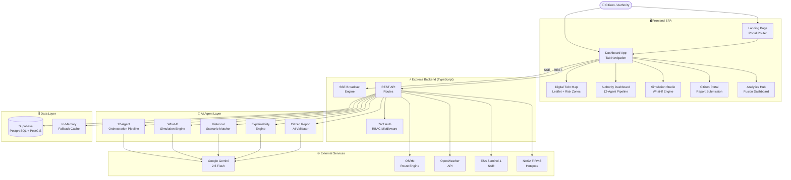
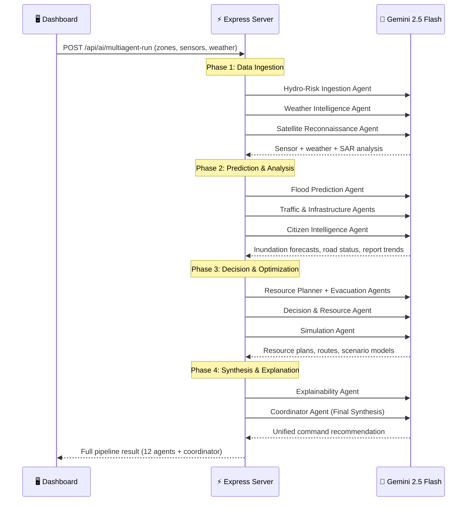
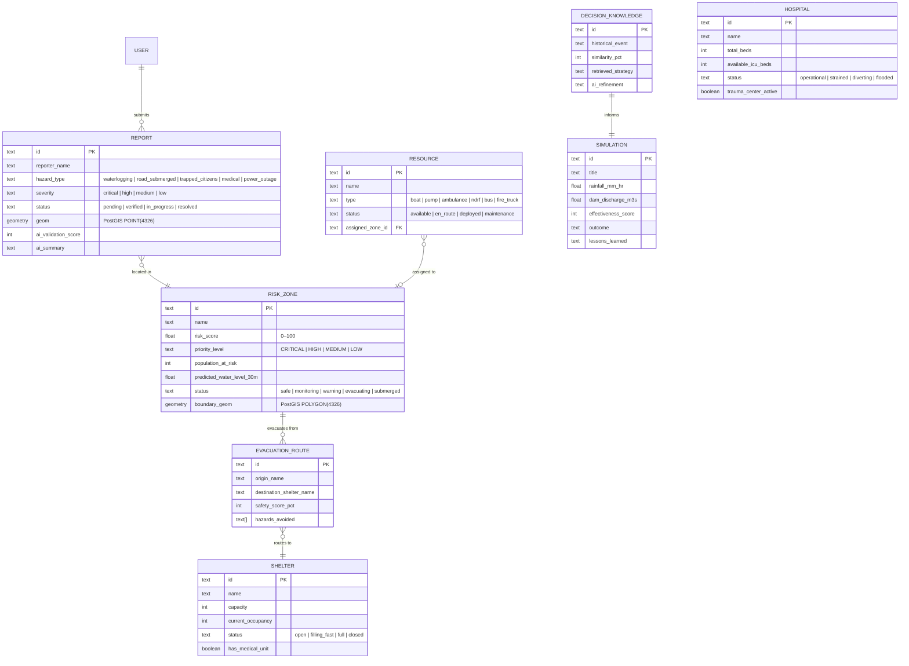

<div align="center">
  <h1>ResponSync ⚡</h1>
  <p><strong>AI-Powered Digital Twin for Predictive Disaster Response</strong></p>
  <p>Real-time city simulation with multi-agent AI orchestration, satellite intelligence, and live citizen reporting — purpose-built for Chennai's flood corridor.</p>

  <p>
    
    
    
    
    
    
    
    
    
  </p>
</div>

<br />

## 📖 Project Overview

ResponSync is a full-stack **AI Decision Digital Twin** — a live virtual city representation that fuses real-time weather, IoT sensor telemetry, satellite radar, citizen reports, and explainable AI into a single command platform for predictive flood response.

The platform is purpose-built for the **Chennai Velachery–Adyar flood corridor**, the most flood-prone urban zone in South India. It combines a 12-agent AI orchestration pipeline (powered by Google Gemini) with real-time geospatial intelligence to autonomously assess threats, simulate cascading impacts, optimize evacuation routes, and dispatch resources — all while providing transparent, explainable reasoning to emergency coordinators.

> **Pilot Area:** Chennai Velachery & Adyar Corridor — covering Velachery South (Vijaya Nagar), Guindy Railway Subway, Kotturpuram Adyar River Bank, and Taramani 100ft Canal Link.

---

## ✨ Key Features

### 🗺️ Digital Twin Map
Interactive Leaflet map rendering the live city state — risk zones with dynamic severity shading, IoT sensor nodes (water level gauges, rain gauges, flow rate sensors), emergency resources, shelters, hospitals, and citizen report markers. Real-time flood polygon overlays from Sentinel-1 SAR satellite data.

### 🤖 12-Agent AI Orchestration Pipeline
Twelve specialized Gemini agents work in concert across a coordinated pipeline:

| Agent | Role |
|-------|------|
| Hydro-Risk Ingestion | Ingest water level & rainfall data |
| Weather Agent | Live weather intelligence & forecast |
| Flood Prediction Agent | Hydrodynamic inundation modeling |
| Traffic Agent | Road network & congestion analysis |
| Infrastructure Agent | Power grid, drainage, bridge status |
| Satellite Agent | Sentinel-1 SAR & NASA FIRMS feeds |
| Citizen Intelligence Agent | Report validation & trend analysis |
| Resource Planner Agent | Optimal resource allocation |
| Evacuation Agent | Safe route computation |
| Simulation Agent | What-if scenario modeling |
| Decision & Resource Agent | Strategic response planning |
| Explainability Agent | Human-readable AI reasoning |

The pipeline concludes with a **Coordinator Agent** that synthesizes all agent outputs into a unified command recommendation with confidence scores.

### 🌊 What-If Disaster Simulation Studio
Run predictive simulations across multiple disaster types (flood, cyclone, earthquake, wildfire, landslide, tsunami) with configurable parameters — rainfall intensity, dam discharge rate, canal blockage percentage, bridge closures, and high tide overlap. Outputs include risk timelines, affected population estimates, and resource deployment plans.

### 🔍 Historical Scenario Matching (RAG)
Retrieval-Augmented Generation engine that matches current conditions against a knowledge base of historical Chennai disasters (2015 Cloudburst, 2021 Cyclone Nivar, 2023 Cyclone Michaung). Returns similarity scores, extracted strategies, and AI-refined recommendations.

### 💬 Explainable AI (XAI) Deep Dive
Every AI recommendation includes full reasoning chains — core rationale, supporting evidence data points, confidence percentages, risk explanations, and alternative risk assessments. Coordinators can drill into any recommendation to understand *why* the AI made a specific decision.

### 🚨 Citizen Hazard Reporting Portal
Citizens submit geo-tagged emergency reports (waterlogging, trapped citizens, road blocks, medical emergencies, power outages, infrastructure damage) with AI-powered validation scoring and automatic category classification via Gemini.

### 📡 Satellite Intelligence Feeds
- **ESA Sentinel-1 SAR** — C-Band synthetic aperture radar for flood extent mapping with backscatter intensity analysis
- **NASA FIRMS** — Near-real-time thermal anomaly detection for flood water reflectance and structural submergence

### ⚡ Real-Time SSE Broadcast Engine
Server-Sent Events push engine for live updates — new citizen reports, agent activity logs, automated alerts, FCM push notifications, and SMS gateway broadcasts propagate instantly to all connected dashboard clients.

### 🔐 JWT Authentication & RBAC
Role-based access control with five agency profiles: TNSDMA Authority, Fire & Rescue, Traffic Police, Emergency Medical, and Citizen. Each role has scoped permissions for dispatching, broadcasting, and report management.

### 🛣️ Flood-Aware Evacuation Routing
Dynamic routing via OSRM with real-time hazard avoidance — automatically detours around submerged subways, breached sluice zones, and waterlogged concourses. Returns polyline waypoints, safety scores, and turn-by-turn instructions.

### 📲 Push Notification & SMS Gateway
FCM push notification service for device-targeted alerts and C-DOT government SMS gateway integration for mass emergency broadcasts with delivery tracking.

---

## 🏗️ System Architecture

ResponSync is a **TypeScript monolith** — a unified Express server hosts both the API backend and the Vite-powered React SPA in middleware mode. No separate frontend/backend processes in development.

### High-Level Architecture



### 12-Agent AI Pipeline Flow



---

## 🗄️ Database Schema

The data model runs on **Supabase PostgreSQL with PostGIS** extensions. Schema is defined in [`supabase_schema.sql`](file:///x:/downloads/responsesync/supabase_schema.sql). The application falls back to an in-memory cache when Supabase credentials are not configured.



---

## 📁 Project Structure

```
responsesync/
├── 📦 package.json                # Dependencies & scripts (dev/build/start)
├── 🔧 vite.config.ts             # Vite + React + Tailwind CSS v4 plugin
├── 📝 tsconfig.json              # TypeScript configuration (ES2022, bundler)
├── 🌐 index.html                 # SPA entry — Leaflet CSS, Google Fonts
├── 📋 supabase_schema.sql        # Full PostgreSQL/PostGIS schema + seed data
├── 🔑 .env.example               # Environment variables template
├── 📖 metadata.json              # Project metadata & capabilities
│
├── src/
│   ├── main.tsx                   # React DOM mount point
│   ├── App.tsx                    # Root component — URL-based routing
│   ├── index.css                  # Global styles (Tailwind v4 + CSS vars)
│   │
│   ├── landing/                   # ── LANDING PAGE ──
│   │   └── LandingPage.tsx        # Public landing with portal routing
│   │
│   ├── dashboard/                 # ── DASHBOARD APP ──
│   │   ├── DashboardApp.tsx       # Tab-based layout (5 views)
│   │   └── components/
│   │       ├── Header.tsx                 # Navigation header + role switcher
│   │       ├── DigitalTwinMap.tsx          # Leaflet map — zones, sensors, resources
│   │       ├── AuthorityDashboard.tsx      # 12-agent AI pipeline control
│   │       ├── SimulationStudio.tsx        # What-if disaster simulator
│   │       ├── CascadingImpactView.tsx     # Multi-disaster cascading analysis
│   │       ├── CitizenPortal.tsx           # Report submission & tracking
│   │       ├── DashboardOverview.tsx       # KPI overview panel
│   │       ├── AnalyticsHub.tsx            # Analytics fusion dashboard
│   │       ├── IncidentsPanel.tsx          # Incident list & status tracker
│   │       ├── ResourcesPanel.tsx          # Resource fleet status
│   │       ├── SheltersPanel.tsx           # Shelter capacity tracker
│   │       ├── HospitalsPanel.tsx          # Hospital bed availability
│   │       ├── SettingsPanel.tsx           # App settings
│   │       ├── ExplainabilityModal.tsx     # XAI reasoning deep-dive modal
│   │       ├── ResourceDispatchModal.tsx   # Resource dispatch action modal
│   │       └── AlertNotificationBanner.tsx # Real-time alert banner
│   │
│   ├── hooks/                     # ── REACT HOOKS ──
│   │   ├── useSSEStream.ts        # SSE EventSource consumer
│   │   └── useEvacuationRoute.ts  # OSRM-powered route calculator
│   │
│   ├── shared/                    # ── SHARED TYPES & DATA ──
│   │   ├── types.ts               # TypeScript interfaces (18 domain types)
│   │   ├── cascadingTypes.ts      # Multi-disaster cascading impact types
│   │   ├── cascadingData.ts       # Cascading impact mock data
│   │   └── mockDigitalTwinData.ts # Digital twin seed data
│   │
│   └── backend/                   # ── EXPRESS BACKEND (TypeScript) ──
│       ├── server.ts              # Express server — all API routes + Vite middleware
│       ├── authMiddleware.ts      # JWT auth, RBAC, role permissions
│       ├── notificationsService.ts # FCM push + SMS gateway service
│       └── satelliteService.ts    # Sentinel-1 SAR + NASA FIRMS data service
│
├── scripts/                       # ── UTILITY SCRIPTS ──
│   ├── populate_db.ts             # Supabase database seeder
│   └── check_supabase.ts         # Supabase connection health check
│
└── docs/features/                 # ── FEATURE DOCUMENTATION ──
    ├── 01_digital_twin_map.md
    ├── 02_multi_agent_system.md
    ├── 03_simulation_studio.md
    ├── 04_scenario_matching.md
    ├── 05_explainable_ai.md
    ├── 06_citizen_portal.md
    ├── 07_supabase_persistence.md
    └── 08_realtime_sse_broadcasts.md
```

---

## 🚀 Quick Start

### Prerequisites

| Requirement | Version |
|-------------|---------|
| Node.js     | 20+     |
| npm         | 10+     |

> Supabase and external API keys are **optional** — the platform runs with in-memory data and realistic simulated feeds when credentials are not configured.

### 1. Clone & Install

```bash
git clone https://github.com/NINJA981/ResponseSync.git
cd ResponseSync
npm install
```

### 2. Configure Environment (Optional)

```bash
cp .env.example .env
```

Fill in any credentials you have available:

| Variable | Description | Required |
|----------|-------------|----------|
| `GEMINI_API_KEY` | Google Gemini API key for AI agent pipeline | Optional — AI features degrade gracefully |
| `SUPABASE_URL` | Supabase project URL | Optional — falls back to in-memory store |
| `SUPABASE_ANON_KEY` | Supabase anonymous key | Optional |
| `OPENWEATHER_API_KEY` | OpenWeather API key for live weather | Optional — uses simulated weather data |
| `MAPBOX_API_KEY` | Mapbox API key | Optional |
| `JWT_SECRET` | Secret for JWT token signing | Optional — uses built-in default |

### 3. Start the Development Server

```bash
npm run dev
```

This single command starts the unified Express + Vite server. Both the API backend and the React frontend are served from one process.

### 4. Access the Platform

| Service | URL |
|---------|-----|
| Landing Page | [http://localhost:3000](http://localhost:3000) |
| Digital Twin Map | [http://localhost:3000/dashboard](http://localhost:3000/dashboard) |
| Authority Command | [http://localhost:3000/authority](http://localhost:3000/authority) |
| Citizen Portal | [http://localhost:3000/citizen](http://localhost:3000/citizen) |
| Simulation Studio | [http://localhost:3000/simulation](http://localhost:3000/simulation) |
| Analytics Hub | [http://localhost:3000/analytics](http://localhost:3000/analytics) |
| Health Check API | [http://localhost:3000/api/health](http://localhost:3000/api/health) |

---

## 📡 API Reference

### Authentication & RBAC

| Method | Endpoint | Description |
|--------|----------|-------------|
| `POST` | `/api/auth/login` | JWT login with role selection |
| `GET` | `/api/auth/me` | Get current authenticated user |
| `POST` | `/api/auth/switch-role` | Switch active agency role |

### Core Data

| Method | Endpoint | Description |
|--------|----------|-------------|
| `GET` | `/api/health` | Server health + service status |
| `GET` | `/api/weather` | Live weather (OpenWeather or simulated) |
| `GET` | `/api/risk` | Aggregated risk zone summary |
| `GET` | `/api/resources` | Resource fleet status |
| `GET` | `/api/recommendations` | Active AI recommendations |
| `GET` | `/api/events` | SSE stream (real-time push) |

### Citizen Reports

| Method | Endpoint | Description |
|--------|----------|-------------|
| `GET` | `/api/reports` | List all citizen reports |
| `POST` | `/api/reports` | Submit new hazard report |

### AI Endpoints

| Method | Endpoint | Description |
|--------|----------|-------------|
| `POST` | `/api/ai/multiagent-run` | Run full 12-agent pipeline |
| `POST` | `/api/ai/simulation` | What-if disaster simulation |
| `POST` | `/api/ai/validate-report` | AI report validation & scoring |
| `POST` | `/api/ai/explainability` | XAI deep-dive reasoning |
| `POST` | `/api/ai/scenario-match` | Historical scenario RAG matching |
| `POST` | `/api/ai/cascading-impact` | Multi-disaster cascading impact prediction |
| `POST` | `/api/ai/evacuation-route` | Flood-aware OSRM routing |

### Notifications

| Method | Endpoint | Description |
|--------|----------|-------------|
| `POST` | `/api/notifications/fcm/register` | Register FCM push token |
| `POST` | `/api/notifications/fcm/send` | Broadcast FCM push alert |
| `POST` | `/api/notifications/sms/send` | Emergency SMS gateway dispatch |
| `GET` | `/api/notifications/history` | Notification broadcast history |

### Satellite Intelligence

| Method | Endpoint | Description |
|--------|----------|-------------|
| `GET` | `/api/gis/satellite/sentinel-sar` | Sentinel-1 SAR flood polygons |
| `GET` | `/api/gis/satellite/nasa-firms` | NASA FIRMS thermal hotspots |
| `GET` | `/api/gis/satellite/metadata` | Active satellite constellation status |

### Infrastructure Data

| Method | Endpoint | Description |
|--------|----------|-------------|
| `GET` | `/api/shelters` | Emergency shelter list + capacity |
| `GET` | `/api/evacuation` | Default evacuation route summary |
| `GET` | `/api/decision-knowledge` | Historical decision knowledge base |
| `GET` | `/api/simulations` | Past simulation history |

---

## ⚙️ Tech Stack

### Frontend

| Technology | Purpose |
|-----------|---------|
| React 19 | UI component library with concurrent rendering |
| TypeScript ~5.8 | Type-safe development |
| Vite 6 | Dev server with HMR (embedded in Express middleware mode) |
| Tailwind CSS 4 | Utility-first styling via Vite plugin |
| Leaflet 1.9 | Interactive map rendering for digital twin |
| Lucide React | Icon library |
| Motion (Framer) | Animation library |

### Backend

| Technology | Purpose |
|-----------|---------|
| Express 4 | HTTP server & API routing |
| tsx | TypeScript execution for development |
| JSON Web Token | JWT auth with role-based access control |
| Google GenAI SDK | Gemini 2.5 Flash integration for 12-agent pipeline |
| Supabase JS | PostgreSQL + PostGIS client |

### Infrastructure

| Technology | Purpose |
|-----------|---------|
| Supabase (PostgreSQL) | Managed database with PostGIS spatial extensions |
| PostGIS | Geospatial indexing & spatial queries |
| OSRM | Open Source Routing Machine for evacuation routes |
| OpenWeather API | Real-time weather data |
| ESA Sentinel-1 | SAR satellite flood detection |
| NASA FIRMS | Near-real-time thermal anomaly feeds |

---

## 🔧 Scripts

| Command | Description |
|---------|-------------|
| `npm run dev` | Start unified dev server (Express + Vite) on port 3000 |
| `npm run build` | Production build (Vite frontend + esbuild backend) |
| `npm start` | Run production build |
| `npm run preview` | Vite preview of frontend build |
| `npm run lint` | TypeScript type checking (`tsc --noEmit`) |
| `npm run clean` | Remove build artifacts |

---

## 🤝 Contributing

1. Fork the repository
2. Create a feature branch (`git checkout -b feature/amazing-feature`)
3. Commit your changes using [Conventional Commits](https://www.conventionalcommits.org/) (`git commit -m 'feat(frontend): add amazing feature'`)
4. Push to the branch (`git push origin feature/amazing-feature`)
5. Open a Pull Request

> **Note:** Always create a new dedicated branch for major code changes.

---

## 📄 License

MIT

<div align="center">
  <p><strong>ResponSync — AI Digital Twin for Predictive Disaster Response</strong> © 2026</p>
  <p>Built with ⚡ by <a href="https://github.com/NINJA981">NINJA981</a></p>
</div>
