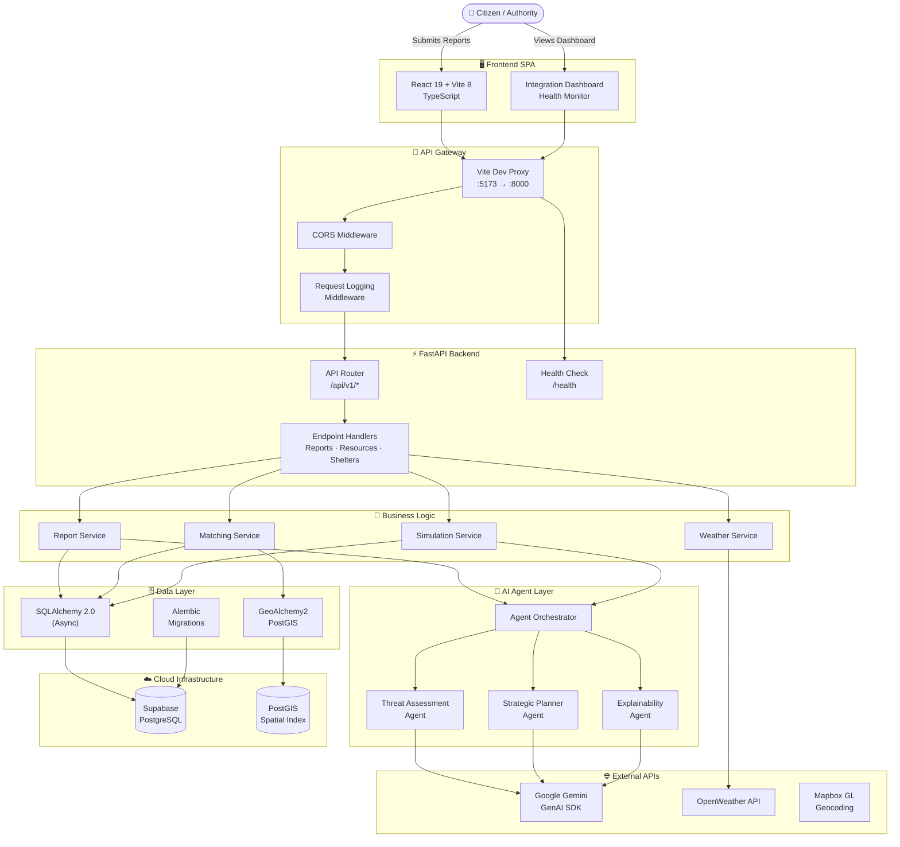
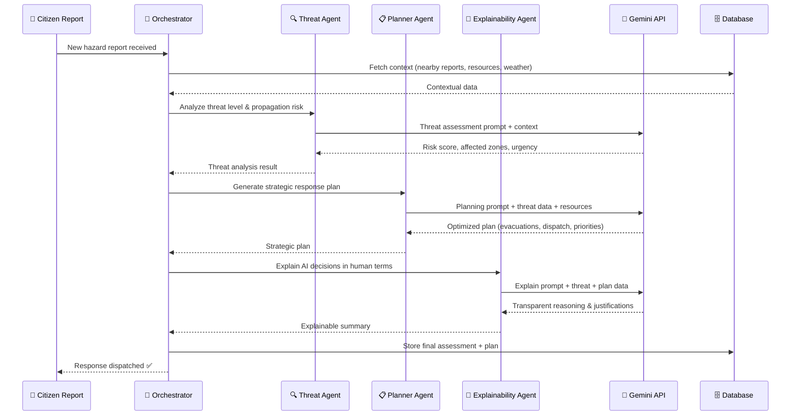
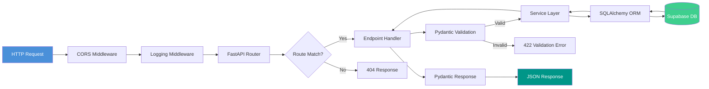
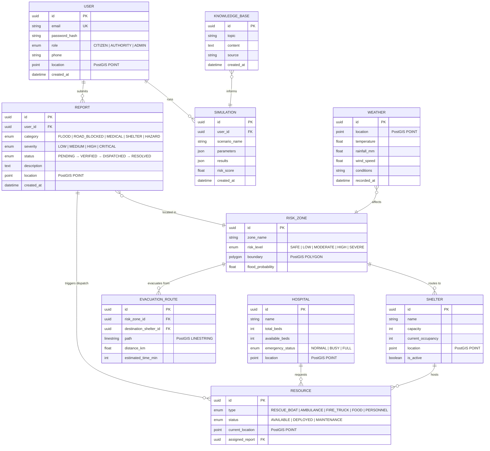

<div align="center">
  <h1>ResponSync ⚡</h1>
  <p><strong>AI-Powered Emergency Response & Disaster Management Platform</strong></p>
  <p>Real-time disaster coordination with multi-agent AI intelligence, geospatial analysis, and live citizen reporting.</p>

  <p>
    
    
    
    
    
    
    
    
    
    
  </p>
</div>

<br />

## 📖 Project Overview

**ResponSync** is a production-grade, full-stack emergency response platform that transforms how disaster situations are managed — from citizen reporting to AI-driven resource allocation.

Traditional disaster management relies on fragmented communication, delayed response chains, and manual resource coordination. ResponSync eliminates these bottlenecks by combining **real-time geospatial intelligence**, **multi-agent AI orchestration**, and **live citizen hazard reporting** into a unified command platform.

Powered by **Google Gemini** and a multi-agent architecture (Threat Assessment → Strategic Planning → Explainability), ResponSync autonomously analyzes incoming reports, predicts risk propagation, optimizes evacuation routes, and dispatches resources — all while providing transparent, explainable reasoning to emergency coordinators.

---

## ✨ Key Features

- **🚨 Citizen Hazard Reporting:** Citizens submit geo-tagged emergency reports (floods, road blocks, medical emergencies) with severity levels and real-time status tracking through a complete lifecycle (Pending → Verified → Dispatched → Resolved).
- **🤖 Multi-Agent AI Orchestration:** Three specialized Gemini agents work in concert — a **Threat Assessment Agent** analyzes incoming data, a **Strategic Planner Agent** generates optimized response plans, and an **Explainability Agent** translates AI decisions into human-readable reasoning.
- **🗺️ Geospatial Intelligence:** Full PostGIS/GeoAlchemy2 integration for spatial queries — risk zone detection, nearest-shelter routing, hospital proximity analysis, and evacuation zone management with real-time geographic coordinates.
- **🏥 Hospital & Shelter Management:** Track hospital capacity (bed counts, emergency status), shelter availability, and resource deployment status across the disaster zone with live updates.
- **📊 Disaster Simulation Engine:** Run predictive simulations with configurable parameters (population, severity, affected area) to forecast resource needs, generate risk scores, and plan preemptive evacuations.
- **🌦️ Weather Intelligence:** Real-time OpenWeather API integration for weather monitoring, flood risk assessment, and environmental condition tracking in affected zones.
- **⚡ Resource Matching & Dispatch:** Intelligent matching service that optimizes deployment of rescue boats, ambulances, fire trucks, food supplies, and personnel based on proximity, urgency, and availability.
- **📡 Real-time Health Monitoring:** Live fullstack integration dashboard with backend health checks, service status monitoring, latency tracking, and automatic reconnection.

---

## 🏗️ System Architecture

ResponSync follows a fully decoupled, production-grade architecture with a React SPA frontend communicating through a Vite dev proxy to a FastAPI async backend, backed by Supabase PostgreSQL with PostGIS extensions and AI-powered by Google Gemini.

### High-Level Architecture



### Multi-Agent AI Workflow

The intelligence layer uses a coordinated multi-agent pipeline where each agent has a specialized role in the decision chain:



### Request Lifecycle



---

## 🗄️ Database Schema

The data model is defined with SQLAlchemy 2.0 ORM and runs on PostgreSQL with PostGIS spatial extensions. The schema captures users, hazard reports, emergency resources, shelters, hospitals, risk zones, evacuation routes, weather data, simulation runs, and AI knowledge bases.



---

## 📁 Project Structure

```
responsync/
├── 📦 package.json                # Root frontend dependencies & scripts
├── 🔧 vite.config.ts             # Vite dev server + proxy configuration
├── 📝 tsconfig.json              # TypeScript configuration
├── 🚫 .gitignore                 # Git exclusion rules
│
├── src/                           # ── FRONTEND (React 19 + TypeScript) ──
│   ├── main.tsx                   # React DOM entry point
│   ├── App.tsx                    # Root component — Integration Dashboard
│   ├── App.css                    # Application styles
│   ├── index.css                  # Global CSS reset & variables
│   └── assets/                    # Static assets (images, icons)
│
├── public/                        # Static public files
├── dist/                          # Production build output
│
└── backend/                       # ── BACKEND (FastAPI + Python 3.12) ──
    ├── requirements.txt           # Python dependencies
    ├── alembic.ini                # Alembic migration configuration
    ├── .env.example               # Environment variables template
    │
    ├── alembic/                   # Database migration scripts
    │   ├── env.py                 # Migration environment config
    │   ├── script.py.mako         # Migration template
    │   └── versions/              # Versioned migration files
    │
    ├── app/
    │   ├── main.py                # FastAPI app factory & lifespan
    │   │
    │   ├── api/                   # API routing layer
    │   │   ├── router.py          # Central router aggregator
    │   │   └── endpoints/         # Route handlers
    │   │       └── health.py      # Health check endpoint
    │   │
    │   ├── core/                  # Application foundation
    │   │   ├── config.py          # Pydantic Settings (env management)
    │   │   ├── exceptions.py      # Custom exception handlers
    │   │   └── logging.py         # Structured logging setup
    │   │
    │   ├── db/                    # Database infrastructure
    │   │   ├── base.py            # SQLAlchemy declarative base
    │   │   ├── database.py        # Async engine factory
    │   │   └── session.py         # Session dependency injection
    │   │
    │   ├── models/                # SQLAlchemy ORM models
    │   │   ├── enums.py           # UserRole, Severity, Status enums
    │   │   ├── user.py            # User model
    │   │   ├── report.py          # Hazard report model
    │   │   ├── resource.py        # Emergency resource model
    │   │   ├── shelter.py         # Shelter model
    │   │   ├── hospital.py        # Hospital model
    │   │   ├── risk_zone.py       # Risk zone (PostGIS polygon)
    │   │   ├── evacuation.py      # Evacuation route model
    │   │   ├── weather.py         # Weather data model
    │   │   ├── simulation.py      # Simulation run model
    │   │   └── knowledge.py       # Knowledge base model
    │   │
    │   ├── schemas/               # Pydantic v2 request/response schemas
    │   │   ├── common.py          # Shared schema utilities
    │   │   ├── health.py          # Health check schemas
    │   │   ├── user.py            # User CRUD schemas
    │   │   ├── report.py          # Report schemas
    │   │   ├── resource.py        # Resource schemas
    │   │   ├── shelter.py         # Shelter schemas
    │   │   ├── hospital.py        # Hospital schemas
    │   │   ├── risk_zone.py       # Risk zone schemas
    │   │   ├── evacuation.py      # Evacuation schemas
    │   │   ├── weather.py         # Weather schemas
    │   │   ├── simulation.py      # Simulation schemas
    │   │   └── knowledge.py       # Knowledge base schemas
    │   │
    │   ├── services/              # Business logic layer
    │   │   ├── report_service.py  # Report CRUD & lifecycle
    │   │   ├── weather_service.py # OpenWeather API integration
    │   │   ├── matching_service.py# Resource-to-report matching
    │   │   └── simulation_service.py # Disaster simulation engine
    │   │
    │   ├── agents/                # AI Agent layer (Gemini)
    │   │   ├── orchestrator.py    # Multi-agent coordinator
    │   │   ├── threat_agent.py    # Threat assessment agent
    │   │   ├── planner_agent.py   # Strategic planning agent
    │   │   └── explainability_agent.py # Decision explainability
    │   │
    │   ├── middleware/            # ASGI middleware stack
    │   │   ├── cors.py            # CORS configuration
    │   │   └── logging.py         # Request/response logging
    │   │
    │   └── utils/                 # Helper utilities
    │
    └── tests/                     # Automated test suite
        ├── conftest.py            # Shared fixtures
        └── test_health.py         # Health endpoint tests
```

---

## 🚀 Quick Start

### Prerequisites

| Requirement | Version |
| :--- | :--- |
| **Node.js** | 20+ |
| **Python** | 3.12+ |
| **PostgreSQL** | 15+ with PostGIS extension |
| **Supabase** | Cloud project (or local) |

### 1. Clone & Install

```bash
# Clone the repository
git clone https://github.com/NINJA981/ResponseSync.git
cd ResponseSync
```

**Frontend Setup:**

```bash
# Install Node.js dependencies
npm install

# Start the Vite dev server (port 5173)
npm run dev
```

**Backend Setup:**

```bash
# Navigate to backend
cd backend

# Create & activate virtual environment
python -m venv .venv

# Windows
.venv\Scripts\activate
# macOS / Linux
source .venv/bin/activate

# Install Python dependencies
pip install -r requirements.txt
```

### 2. Configure Environment

```bash
# Copy the environment template
cp backend/.env.example backend/.env
```

Fill in your credentials:

| Variable | Description |
| :--- | :--- |
| `DATABASE_URL` | PostgreSQL async connection string (`postgresql+asyncpg://...`) |
| `SUPABASE_URL` | Supabase Project URL |
| `SUPABASE_KEY` | Supabase Anon Key |
| `GEMINI_API_KEY` | Google Gemini API Key |
| `OPENWEATHER_API_KEY` | OpenWeather API Key |
| `MAPBOX_API_KEY` | Mapbox GL API Key |
| `JWT_SECRET` | Secret key for JWT signing |
| `REDIS_URL` | Redis connection string (caching layer) |

### 3. Run Database Migrations

```bash
cd backend
alembic upgrade head
```

### 4. Start the Backend Server

```bash
cd backend
uvicorn app.main:app --reload --port 8000
```

### 5. Access the Platform

| Service | URL |
| :--- | :--- |
| **Frontend Dashboard** | `http://localhost:5173` |
| **Backend API** | `http://127.0.0.1:8000` |
| **OpenAPI (Swagger)** | `http://127.0.0.1:8000/docs` |
| **ReDoc API Docs** | `http://127.0.0.1:8000/redoc` |
| **Health Check** | `http://127.0.0.1:8000/health` |

---

## ⚙️ Tech Stack Deep Dive

### Frontend

| Technology | Purpose |
| :--- | :--- |
| **React 19** | UI component library with latest concurrent features |
| **TypeScript 6** | Type-safe frontend development |
| **Vite 8** | Lightning-fast dev server with HMR & proxy |
| **Oxlint** | Blazing-fast linter (Rust-based) |

### Backend

| Technology | Purpose |
| :--- | :--- |
| **FastAPI** | Async Python web framework with auto OpenAPI docs |
| **SQLAlchemy 2.0** | Async ORM with modern mapped column syntax |
| **GeoAlchemy2** | PostGIS integration for spatial queries |
| **Pydantic v2** | Data validation & serialization |
| **Alembic** | Database schema migrations |
| **httpx** | Async HTTP client for external APIs |
| **Google GenAI SDK** | Gemini LLM integration for AI agents |

### Infrastructure

| Technology | Purpose |
| :--- | :--- |
| **Supabase (PostgreSQL)** | Managed database with PostGIS extensions |
| **PostGIS** | Geospatial indexing & spatial queries |
| **Redis** | Caching layer & session management |
| **OpenWeather API** | Real-time weather data |
| **Mapbox GL** | Map rendering & geocoding |

---

## 🧪 Running Tests

```bash
cd backend

# Run all tests
pytest

# Run with verbose output
pytest -v

# Run specific test file
pytest tests/test_health.py
```

---

## 🗄 Database Migrations

```bash
cd backend

# Generate a new migration after model changes
alembic revision --autogenerate -m "Add new table"

# Apply pending migrations
alembic upgrade head

# Downgrade one revision
alembic downgrade -1

# View migration history
alembic history
```

---

## 🤝 Contributing

1. **Fork** the repository
2. **Create** a feature branch (`git checkout -b feature/amazing-feature`)
3. **Commit** your changes (`git commit -m 'feat: add amazing feature'`)
4. **Push** to the branch (`git push origin feature/amazing-feature`)
5. **Open** a Pull Request

> **Note:** Always create a new dedicated branch for major code changes.

---

## 📄 License

MIT

---

<div align="center">
  <p><strong>ResponSync Emergency Response Platform</strong> © 2026</p>
  <p>Built with ⚡ by <a href="https://github.com/NINJA981">NINJA981</a></p>
</div>tell e from this tech stack
