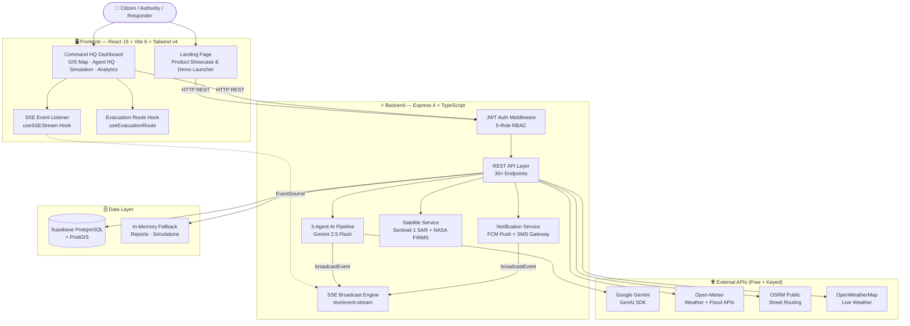
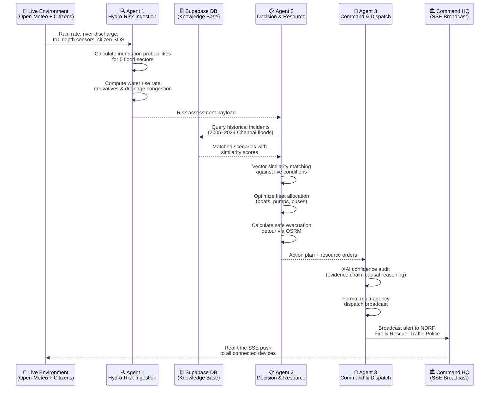
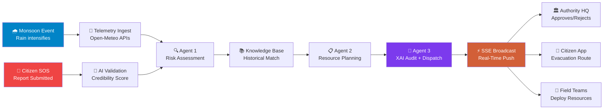
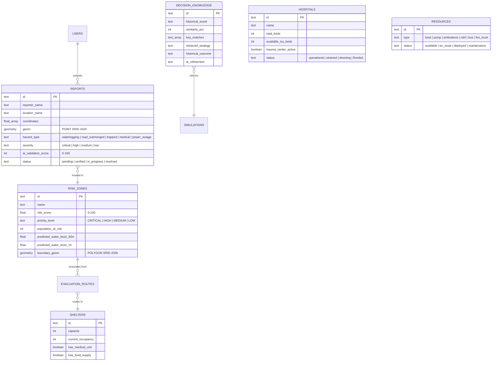

<div align="center">
  <h1>⚡ ResponSync</h1>
  <h3>AI Decision Digital Twin for Predictive Disaster Response</h3>
  <p>A live virtual city representation combining real-time weather, hydrology, satellite radar, citizen reports, and explainable multi-agent AI for predictive flood response coordination.</p>
  <p><em>Pilot Region: Chennai Velachery–Adyar Corridor, Tamil Nadu, India</em></p>

  <br />

  <p>
    
    
    
    
    
    
    
    
    
    
    
  </p>
</div>

<br />

---

## 👥 Team Details

| Role | Name | GitHub |
| :--- | :--- | :--- |
| **Team Lead / Full-Stack** | Mohan | [@goprocker](https://github.com/goprocker) |

> **Repository:** [github.com/goprocker/ResponseSync](https://github.com/goprocker/ResponseSync)

---

## 🎯 Problem Statement

### The Problem

Chennai experiences catastrophic urban flooding almost every monsoon season. The **December 2015 cloudburst** displaced over 1.8 million people, caused ₹20,000 crore in damages, and exposed critical failures in disaster coordination:

- **Delayed Response:** Manual communication chains between 5+ government agencies (NDRF, Fire & Rescue, Traffic Police, Health, Municipal) cause 30–60 minute delays
- **No Predictive Intelligence:** Authorities react *after* flooding occurs instead of pre-positioning resources *before* peak inundation
- **Fragmented Citizen Reporting:** Citizen SOS calls via phone/WhatsApp are unstructured, unverified, and cannot be geo-tagged or prioritized automatically
- **No Historical Learning:** Lessons from past disasters (2015, 2021 Nivar, 2023 Michaung) are not systematically applied to current incidents
- **Opaque AI Decisions:** Even when AI tools exist, emergency coordinators don't trust them because they can't explain *why* a recommendation was made

### Our Solution

**ResponSync** is an AI-powered Digital Twin that creates a live virtual replica of Chennai's Velachery–Adyar flood corridor, combining:

1. **Real-time telemetry** (weather radar, river discharge, IoT sensors) with **citizen crowdsourced intelligence**
2. **3-Agent Autonomous AI Pipeline** that ingests, reasons, and dispatches — with full explainability
3. **Historical disaster knowledge base** (2005–2024) for evidence-backed decision-making
4. **Safe evacuation routing** via OSRM with real-time hazard avoidance
5. **Multi-agency broadcast** via SSE, FCM push, and emergency SMS — all in under 15 seconds

> **Key Differentiator:** Every AI recommendation comes with an *Explainable AI (XAI) audit* — evidence chain, causal reasoning, counterfactual analysis, and confidence scores — so incident commanders can trust and act on AI decisions.

---

## ✨ Features

| # | Feature | Description |
| :---: | :--- | :--- |
| 1 | 🗺️ **Digital Twin GIS Map** | Interactive Leaflet dark-mode map with live flood inundation polygons, IoT sensor nodes, risk zone overlays, resource markers, hospital pins, shelter icons, and time-horizon sliders (`Live`, `+30m`, `+1h`, `+2h`) |
| 2 | 🤖 **3-Agent AI Pipeline** | Autonomous Hydro-Risk → Decision → Command pipeline powered by Google Gemini. Ingests live telemetry, matches against historical knowledge base, generates XAI-audited action plans |
| 3 | 🛰️ **Satellite GIS Intelligence** | ESA Copernicus Sentinel-1 SAR backscatter flood detection polygons and NASA FIRMS VIIRS/MODIS thermal telemetry for inundation verification |
| 4 | 🚨 **Citizen Emergency Portal** | Geo-tagged SOS report submission with AI credibility scoring (0–100), automated hazard classification, and safe evacuation route calculator |
| 5 | 🔬 **What-If Simulation Studio** | Hydrodynamic disaster sandbox with sliders for rainfall (mm/hr), dam discharge (m³/s), canal blockage (%), bridge status, and high tide overlap |
| 6 | 📚 **Scenario Matching Engine** | Vector similarity matching of live conditions against 10+ historical Chennai flood incidents (2005–2024) stored in Supabase |
| 7 | 💡 **Explainable AI Inspector** | Visual evidence chain, 4-step causal reasoning, counterfactual delay-risk analysis, and resource allocation tradeoff transparency |
| 8 | 🔐 **JWT Role-Based Access** | 5 operational profiles — Disaster Mgmt HQ, Fire & Rescue, Traffic Police, Health & Hospitals, Citizen — each with scoped permissions |
| 9 | 📡 **Real-Time SSE Engine** | Zero-latency Server-Sent Events broadcasting citizen reports, agent decisions, push alerts, and SMS dispatches to all connected clients |
| 10 | 📱 **FCM Push & SMS Gateway** | Simulated Firebase Cloud Messaging push notifications and C-DOT CAP emergency SMS gateway dispatch with delivery logging |
| 11 | 🏥 **Hospital & Shelter Tracking** | Live bed capacity, ICU availability, trauma center status, shelter occupancy, food supply days, medical unit availability |
| 12 | 🌦️ **Live Weather Intelligence** | OpenWeatherMap + Open-Meteo Weather & Flood APIs for real-time rainfall, river discharge, humidity, and wind telemetry |

---

## ⚙️ Complete Tech Stack

### Frontend

| Technology | Version | Purpose |
| :--- | :---: | :--- |
| **React** | 19 | UI component library with concurrent rendering |
| **TypeScript** | 5.8 | Strict type-safe development |
| **Vite** | 6.2 | Lightning-fast dev server with HMR |
| **Tailwind CSS** | v4 | Utility-first CSS framework |
| **Leaflet** | 1.9 | Interactive GIS map rendering |
| **Lucide React** | 0.546 | Icon library |
| **Motion** | 12.23 | Smooth animations & transitions |

### Backend

| Technology | Version | Purpose |
| :--- | :---: | :--- |
| **Node.js** | 20+ | JavaScript server runtime |
| **Express** | 4.21 | HTTP server with REST API routing |
| **TypeScript (tsx)** | 4.21 | Type-safe server execution |
| **Google GenAI SDK** | 2.4 | Gemini LLM integration for AI agents |
| **jsonwebtoken** | 9.0 | JWT authentication & RBAC |
| **@supabase/supabase-js** | 2.110 | PostgreSQL/PostGIS client |
| **dotenv** | 17.2 | Environment variable management |
| **esbuild** | 0.25 | Production server bundler |

### Database & Infrastructure

| Technology | Purpose |
| :--- | :--- |
| **Supabase PostgreSQL** | Managed cloud database with Row Level Security |
| **PostGIS** | Geospatial indexing & spatial queries (GEOMETRY Point/Polygon SRID 4326) |
| **In-Memory Cache** | Graceful fallback when Supabase is unavailable |

### External API Integrations

| Service | Purpose | Auth Required |
| :--- | :--- | :---: |
| **Google Gemini 2.5 Flash** | AI reasoning, scenario matching, XAI generation | API Key |
| **Open-Meteo Weather API** | Live rain rate, humidity, wind speed, pressure | ❌ Free |
| **Open-Meteo Flood API** | Global river discharge telemetry (Adyar Basin) | ❌ Free |
| **OSRM Public Router** | Street-level evacuation routing with GeoJSON | ❌ Free |
| **OpenWeatherMap** | Alternative live weather feed (Velachery 12.98, 80.22) | API Key |
| **ESA Copernicus Sentinel-1** | SAR C-Band synthetic aperture radar flood detection | Simulated |
| **NASA FIRMS** | VIIRS/MODIS thermal & flood water hotspot telemetry | Simulated |

---

## 🏗️ System Architecture Diagram



---

## 🤖 AI/ML Workflow — 3-Agent Autonomous Pipeline

### Agent Architecture Overview

ResponSync uses a **3-Agent Autonomous AI Pipeline** where each agent has a specialized role, operates sequentially, and passes enriched context to the next:



### Detailed Agent Descriptions

#### 🔍 Agent 1: Hydro-Risk Ingestion Agent

| Attribute | Detail |
| :--- | :--- |
| **Purpose** | First responder in the AI pipeline — ingests and fuses all live environmental data streams |
| **Data Sources** | Open-Meteo Weather API (rain, wind, humidity), Open-Meteo Flood API (river discharge m³/s), IoT water depth sensors, citizen SOS reports from Supabase |
| **Processing** | Calculates short-term inundation risk probabilities for 5 flood sectors (Velachery South, Guindy Subway, Kotturpuram, Taramani Link, Adyar Estuary). Computes water depth rise rate derivatives, drainage congestion percentages, and estuarine high-tide overlap factors |
| **Output** | Risk-scored zone matrix with predicted water levels at `+30m`, `+1h`, and `+2h` horizons |

**Behavior by scenario:**
| Scenario | Rain Rate | Discharge | Action |
| :--- | :---: | :---: | :--- |
| 🟢 Normal | 2.4 mm/hr | 120 m³/s | Reports zero flood risk. All sensors nominal. Drainage capacity exceeds inflow by 800% |
| 🟡 Moderate | 42 mm/hr | 620 m³/s | Detects moderate inundation risk. Guindy subway waterlogging at 0.8ft. Processes 2 citizen SOS reports |
| 🔴 Flood | 110 mm/hr | 1850 m³/s | Extreme cloudburst alert. Predicts +1.6m water depth in 30 minutes. 68,500 population at risk. 5+ critical SOS reports verified |

---

#### 📋 Agent 2: Decision & Resource Agent

| Attribute | Detail |
| :--- | :--- |
| **Purpose** | Strategic brain — matches historical patterns, allocates resources, and plans evacuation |
| **Data Sources** | Agent 1's risk assessment, Supabase `decision_knowledge` table (10+ historical Chennai flood events: 2005, 2008, 2015, 2016, 2017, 2020, 2021, 2022, 2023, 2024) |
| **Processing** | Performs vector similarity matching of current rainfall, dam discharge, and river stage against historical incident parameters. Selects optimal resource deployment from available fleet (NDRF motorboats, 500HP dewatering pumps, ambulances, transit buses). Calculates flood-avoiding evacuation detour via OSRM, bypassing submerged corridors (Guindy Subway, Velachery Lake Sluice) |
| **Output** | Resource deployment orders, matched historical strategies with similarity percentages, safe route waypoints |

**Behavior by scenario:**
| Scenario | Historical Match | Resource Allocation | Routing |
| :--- | :--- | :--- | :--- |
| 🟢 Normal | No match needed | Standby patrol units | All routes 100% clear |
| 🟡 Moderate | 2021 Cyclone Nivar (86%) | 2 × 500HP dewatering pumps → Guindy Subway | GST Road Flyover advisory |
| 🔴 Flood | 2015 Cloudburst (94%) | 4 × NDRF boat units + 2 × pumps → Velachery | Taramani Link Road emergency detour |

---

#### 📡 Agent 3: Command & Dispatch Agent

| Attribute | Detail |
| :--- | :--- |
| **Purpose** | Final authority — audits decisions for explainability, formats dispatch orders, broadcasts to all agencies |
| **Data Sources** | Agent 2's action plan, resource allocation, and historical match data |
| **Processing** | Generates Explainable AI (XAI) confidence score (0–100%). Builds 4-step causal evidence chain. Computes counterfactual delay-risk analysis ("If deployment delayed by 15 minutes, ~1,400 citizens trapped"). Formats automated alert headlines, agency notification lists, and citizen instructions |
| **Output** | XAI-audited recommendation card, multi-agency broadcast via SSE/FCM/SMS, dispatch confirmation |

**Behavior by scenario:**
| Scenario | XAI Confidence | Alert Level | Agencies Notified |
| :--- | :---: | :--- | :--- |
| 🟢 Normal | 99% | `INFO` — All corridors clear | Disaster Mgmt HQ (routine heartbeat) |
| 🟡 Moderate | 92% | `WARNING` — Guindy subway waterlogged | Traffic Police, Corporation Officers |
| 🔴 Flood | 96% | `CRITICAL` — Flash flood warning | NDRF, Fire & Rescue, Traffic Police, Health 108 |

---

### AI Pipeline — Gemini Integration Details

```
┌─────────────────────────────────────────────────────────────┐
│                    POST /api/ai/multiagent-run               │
│                                                              │
│  1. Fetch live telemetry from Open-Meteo (weather + flood)   │
│  2. Fetch citizen reports from Supabase                      │
│  3. Fetch historical knowledge base from Supabase            │
│  4. Fetch risk zones from Supabase                           │
│  5. Select scenario preset (normal / moderate / flood)       │
│                                                              │
│  6. Construct structured prompt with all data context         │
│  7. Send to Google Gemini 2.5 Flash (responseMimeType: JSON) │
│  8. Parse structured JSON response                            │
│  9. Broadcast result via SSE to all connected clients         │
│                                                              │
│  Fallback: If Gemini unavailable → Physics-engine heuristic  │
│            generates deterministic response from parameters   │
└─────────────────────────────────────────────────────────────┘
```

---

## 📊 Detailed Workflow

### End-to-End Disaster Response Flow



### Citizen Report Lifecycle

```
Citizen submits SOS → POST /api/reports
    ↓
AI Validation Agent scores credibility (0-100)
    ↓
Report persisted to Supabase + In-Memory
    ↓
SSE broadcasts "citizen_report_created" to all clients
    ↓
Report appears on Digital Twin Map + Incidents Panel
    ↓
Authority approves → Resource dispatched
    ↓
Status: pending → verified → dispatched → resolved
```

### Evacuation Routing Flow

```
User selects shelter → POST /api/ai/evacuation-route
    ↓
OSRM fetches street geometry (origin → destination)
    ↓
Flood hazard check: Guindy Subway? Velachery Sluice?
    ↓
If hazard detected → Calculate elevated detour via Taramani Link
    ↓
Return: waypoints[], distanceKm, durationMins, safetyScorePct, hazardsAvoided[]
    ↓
Rendered as polyline on Leaflet GIS Map
```

---

## 📁 Folder Structure

```
ResponSync/
├── 📦 package.json              # Dependencies & npm scripts
├── 🔧 vite.config.ts            # Vite dev server + React/Tailwind plugins
├── 📝 tsconfig.json             # TypeScript ES2022 configuration
├── 🌐 index.html                # SPA entry — Leaflet CDN + Google Fonts
├── 🗃️ metadata.json             # AI Studio platform metadata
├── 🗄️ supabase_schema.sql       # PostGIS database schema + seed data
├── 🔑 .env.example              # Environment variable template
├── 🚫 .gitignore                # Git exclusion rules
│
├── src/                          # ── SOURCE CODE ──
│   ├── main.tsx                  # React DOM mount + ErrorBoundary wrapper
│   ├── App.tsx                   # Client-side URL router & view switcher
│   ├── ErrorBoundary.tsx         # Graceful runtime crash handler UI
│   ├── index.css                 # Tailwind CSS v4 + custom design tokens
│   │
│   ├── backend/                  # ── EXPRESS SERVER & SERVICES ──
│   │   ├── server.ts             # Core server: 30+ REST endpoints, SSE engine,
│   │   │                         #   3-Agent AI pipeline, OSRM routing
│   │   ├── authMiddleware.ts     # JWT token generation, verification, 5-role RBAC
│   │   ├── notificationsService.ts # FCM push notifications + C-DOT SMS gateway
│   │   └── satelliteService.ts   # Sentinel-1 SAR + NASA FIRMS GIS telemetry
│   │
│   ├── dashboard/                # ── COMMAND HQ DASHBOARD ──
│   │   ├── DashboardApp.tsx      # Main layout shell, tab state, SSE hooks, modals
│   │   └── components/           # 15 specialized UI components
│   │       ├── DigitalTwinMap.tsx           # Leaflet GIS (risk polygons, markers, routing)
│   │       ├── AuthorityDashboard.tsx       # 3-Agent activity logs & XAI recommendations
│   │       ├── SimulationStudio.tsx         # What-If hydrodynamic disaster sandbox
│   │       ├── CitizenPortal.tsx            # SOS submission & evacuation routing
│   │       ├── DashboardOverview.tsx        # Operational summary & risk matrix
│   │       ├── AnalyticsHub.tsx             # Telemetry charts & resource metrics
│   │       ├── Header.tsx                   # Alert banner, JWT role switcher
│   │       ├── ExplainabilityModal.tsx      # XAI evidence & causal chain inspector
│   │       ├── HospitalsPanel.tsx           # Hospital capacity & ICU tracker
│   │       ├── SheltersPanel.tsx            # Relief camp directory
│   │       ├── ResourcesPanel.tsx           # Emergency asset inventory
│   │       ├── IncidentsPanel.tsx           # Citizen report table & dispatch actions
│   │       ├── ResourceDispatchModal.tsx    # Asset assignment modal
│   │       ├── AlertNotificationBanner.tsx  # Flashing emergency alert bar
│   │       └── SettingsPanel.tsx            # API key status & system config
│   │
│   ├── landing/                  # ── PUBLIC LANDING PAGE ──
│   │   └── LandingPage.tsx       # Product showcase, feature cards, demo launcher
│   │
│   ├── hooks/                    # ── CUSTOM REACT HOOKS ──
│   │   ├── useSSEStream.ts       # EventSource connection for real-time updates
│   │   └── useEvacuationRoute.ts # Dynamic flood-avoiding route fetcher
│   │
│   └── shared/                   # ── DOMAIN MODELS & SEED DATA ──
│       ├── types.ts              # 15+ TypeScript domain interfaces
│       └── mockDigitalTwinData.ts # Initial Chennai disaster corridor state
│
├── scripts/                      # ── UTILITY SCRIPTS ──
│   ├── populate_db.ts            # Seed Supabase with 10+ historical flood incidents
│   └── check_supabase.ts        # Database connectivity diagnostic
│
└── docs/                         # ── FEATURE DOCUMENTATION ──
    └── features/
        ├── 01_digital_twin_map.md
        ├── 02_multi_agent_system.md
        ├── 03_simulation_studio.md
        ├── 04_scenario_matching.md
        ├── 05_explainable_ai.md
        ├── 06_citizen_portal.md
        ├── 07_supabase_persistence.md
        └── 08_realtime_sse_broadcasts.md
```

---

## 🚀 Installation & Usage Guide

### Prerequisites

| Requirement | Version | Notes |
| :--- | :---: | :--- |
| **Node.js** | 20+ | LTS recommended |
| **npm** | 10+ | Comes with Node.js |
| **Supabase** | Cloud | Optional — falls back to in-memory store |

### Step 1: Clone & Install

```bash
git clone https://github.com/goprocker/ResponseSync.git
cd ResponseSync
npm install
```

### Step 2: Configure Environment

```bash
cp .env.example .env
```

Edit `.env` with your credentials:

| Variable | Required | Description |
| :--- | :---: | :--- |
| `GEMINI_API_KEY` | ✅ | Google Gemini API key for 3-Agent AI pipeline |
| `SUPABASE_URL` | Optional | Supabase project URL (graceful fallback to in-memory) |
| `SUPABASE_ANON_KEY` | Optional | Supabase anonymous key |
| `OPENWEATHER_API_KEY` | Optional | OpenWeatherMap key (fallback: simulated weather) |
| `JWT_SECRET` | Optional | JWT signing secret (defaults to built-in) |

### Step 3: Seed Database (Optional)

```bash
npx tsx scripts/populate_db.ts
```

This populates Supabase with historical flood data (2005–2024), risk zones, shelters, hospitals, resources, and citizen reports.

### Step 4: Start Development Server

```bash
npm run dev
```

This starts the Express backend with embedded Vite middleware on **port 3000**.

### Step 5: Access the Platform

| Page | URL | Description |
| :--- | :--- | :--- |
| 🏠 Landing Page | http://localhost:3000 | Product showcase & demo launcher |
| 🗺️ Digital Twin Map | http://localhost:3000/dashboard | Live GIS map with flood overlays |
| 🏛️ Authority Command HQ | http://localhost:3000/authority | 3-Agent logs & XAI recommendations |
| 🔬 Simulation Studio | http://localhost:3000/simulation | What-If hydrodynamic sandbox |
| 🚨 Citizen Portal | http://localhost:3000/citizen | SOS reporting & evacuation routing |
| 📊 Analytics Hub | http://localhost:3000/analytics | Telemetry charts & resource metrics |
| ❤️ Health Check | http://localhost:3000/api/health | Service status JSON |

### Production Build

```bash
npm run build    # Vite frontend + esbuild server bundle
npm start        # Serve from dist/server.cjs
```

---

## 🔌 API Documentation

### Authentication & RBAC (JWT)

| Method | Endpoint | Description |
| :--- | :--- | :--- |
| `POST` | `/api/auth/login` | Issue 24h JWT for role (`authority`, `fire_rescue`, `police`, `health_hospitals`, `citizen`) |
| `GET` | `/api/auth/me` | Validate Bearer token & return user profile + permissions |
| `POST` | `/api/auth/switch-role` | Re-issue JWT when switching operational role |

### Real-Time Events & Notifications

| Method | Endpoint | Description |
| :--- | :--- | :--- |
| `GET` | `/api/events` | SSE stream — broadcasts `citizen_report_created`, `multiagent_update`, `fcm_push_alert`, `sms_emergency_alert` |
| `POST` | `/api/notifications/fcm/register` | Register FCM device token with location zone |
| `POST` | `/api/notifications/fcm/send` | Broadcast push notification + emit SSE event |
| `POST` | `/api/notifications/sms/send` | C-DOT emergency SMS gateway dispatch |
| `GET` | `/api/notifications/history` | Notification broadcast log history |

### GIS & Satellite Intelligence

| Method | Endpoint | Description |
| :--- | :--- | :--- |
| `GET` | `/api/gis/satellite/sentinel-sar` | Sentinel-1 C-Band SAR GeoJSON flood polygons (backscatter < -20dB) |
| `GET` | `/api/gis/satellite/nasa-firms` | NASA FIRMS VIIRS/MODIS thermal hotspot array |
| `GET` | `/api/gis/satellite/metadata` | Orbital overpass schedule (Sentinel-1A, VIIRS, ISRO RISAT-1A) |

### Weather & Telemetry

| Method | Endpoint | Description |
| :--- | :--- | :--- |
| `GET` | `/api/weather` | Live Chennai weather from OpenWeatherMap (+ simulated fallback) |
| `GET` | `/api/risk` | Aggregate risk score for pilot region |
| `GET` | `/api/health` | Service health: Gemini, Supabase, Weather, JWT, FCM, SAR |

### Core Data Entities

| Method | Endpoint | Description |
| :--- | :--- | :--- |
| `GET` | `/api/reports` | Citizen reports (Supabase or in-memory) |
| `POST` | `/api/reports` | Submit new report → persist + SSE broadcast |
| `GET` | `/api/shelters` | Emergency shelter directory |
| `GET` | `/api/resources` | Rescue asset inventory |
| `GET` | `/api/decision-knowledge` | Historical disaster knowledge base |
| `GET` | `/api/simulations` | Simulation records list |
| `GET` | `/api/simulation/:id` | Individual simulation detail |
| `GET` | `/api/evacuation` | Evacuation route overview |
| `GET` | `/api/recommendations` | Active action recommendations summary |

### AI & Machine Learning Engine

| Method | Endpoint | Description |
| :--- | :--- | :--- |
| `POST` | `/api/ai/multiagent-run` | Execute 3-Agent pipeline (presets: `normal`, `moderate`, `flood`) |
| `POST` | `/api/ai/scenario-match` | Match live conditions against historical flood database |
| `POST` | `/api/ai/simulate` | Hydrodynamic what-if inundation projections |
| `POST` | `/api/ai/evacuation-route` | OSRM street routing + flood hazard avoidance |
| `POST` | `/api/ai/validate-report` | AI credibility scoring of citizen SOS reports |
| `POST` | `/api/ai/explain-decision` | XAI evidence chain + counterfactual analysis |

---

## 🗄️ Database Documentation

### Schema Overview

PostgreSQL with **PostGIS** spatial extensions, hosted on Supabase. Full schema: [`supabase_schema.sql`](supabase_schema.sql)



### Tables

| Table | Records | Purpose |
| :--- | :---: | :--- |
| `users` | – | User profiles with RBAC roles |
| `reports` | 2+ seed | Citizen SOS reports with PostGIS Point geometry |
| `risk_zones` | 4 seed | Flood inundation zones with Polygon geometry |
| `decision_knowledge` | 3+ seed | Historical disaster incidents (2015, 2021, 2023) |
| `simulations` | – | What-If simulation run logs |
| `resources` | 4 seed | Emergency fleet (boats, pumps, ambulances, buses) |
| `shelters` | 3 seed | Relief camps with capacity tracking |
| `hospitals` | – | Hospital bed & ICU availability |
| `weather_cache` | – | Hydro-meteorological readings |
| `evacuation_routes` | – | Safe route waypoints with safety scores |

---

## 🔒 Security Measures

| Layer | Implementation |
| :--- | :--- |
| **Authentication** | JWT Bearer tokens with 24-hour expiry via `jsonwebtoken` |
| **Authorization (RBAC)** | 5 roles with scoped permissions: `all_access`, `dispatch_resources`, `trigger_alerts`, `manage_barricades`, `submit_report`, etc. |
| **Role Enforcement** | `authenticateJWT` middleware validates token on protected routes; `requireRole()` middleware enforces role-level access |
| **API Key Security** | Gemini and Supabase keys stored in `.env` (never exposed to client). Server-side only |
| **Row Level Security** | Supabase RLS enabled on all 7 primary tables with explicit access policies |
| **Input Validation** | Express `express.json({ limit: '10mb' })` body size limit. Request body validation on all POST endpoints |
| **TLS Handling** | `NODE_TLS_REJECT_UNAUTHORIZED` relaxed only in development mode |
| **Error Boundaries** | React `ErrorBoundary` component wraps entire app — prevents white-screen crashes |
| **Graceful Degradation** | Every external service (Supabase, Gemini, OpenWeather, OSRM) has fallback behavior if unavailable |

---

## 🧪 Testing & Performance

### Type Safety Verification

```bash
npm run lint    # tsc --noEmit — full TypeScript strict mode check
```

### Database Connectivity Check

```bash
npx tsx scripts/check_supabase.ts    # Verifies all 7 Supabase table connections
```

### Manual Testing Guides

Each feature has a dedicated manual testing protocol in [`docs/features/`](docs/features/):

| Feature | Guide |
| :--- | :--- |
| Digital Twin GIS Map | [01_digital_twin_map.md](docs/features/01_digital_twin_map.md) |
| 3-Agent AI System | [02_multi_agent_system.md](docs/features/02_multi_agent_system.md) |
| Simulation Studio | [03_simulation_studio.md](docs/features/03_simulation_studio.md) |
| Scenario Matching | [04_scenario_matching.md](docs/features/04_scenario_matching.md) |
| Explainable AI | [05_explainable_ai.md](docs/features/05_explainable_ai.md) |
| Citizen Portal | [06_citizen_portal.md](docs/features/06_citizen_portal.md) |
| Supabase Persistence | [07_supabase_persistence.md](docs/features/07_supabase_persistence.md) |
| Real-Time SSE | [08_realtime_sse_broadcasts.md](docs/features/08_realtime_sse_broadcasts.md) |

### Performance Characteristics

| Metric | Value |
| :--- | :--- |
| SSE event broadcast latency | < 50ms (server → all clients) |
| 3-Agent pipeline (Gemini) | ~2–4 seconds end-to-end |
| 3-Agent pipeline (heuristic fallback) | < 100ms |
| OSRM evacuation route calculation | ~200–500ms |
| Supabase query (reports/zones) | ~100–300ms |
| Frontend initial load (Vite HMR) | < 1 second |
| Leaflet map render with overlays | < 500ms |

---

## 🧗 Challenges Faced & Future Scope

### Challenges Faced

| Challenge | How We Solved It |
| :--- | :--- |
| **Gemini API unavailability** | Built a complete physics-engine heuristic fallback that generates deterministic responses from environmental parameters — the app never breaks |
| **Supabase connection failures** | Implemented dual-path architecture: every query tries Supabase first, falls back to in-memory cache transparently |
| **SSE connection stability** | Used `useRef` pattern in React to prevent re-mounting EventSource on callback changes. Auto-reconnection on errors |
| **Coordinate format inconsistency** | SSE payloads could have `{lat, lng}` objects or `[lat, lng]` arrays — built a universal coordinate resolver with `Number()` coercion and fallback defaults |
| **Map rendering with dynamic overlays** | 15+ Leaflet layers (polygons, markers, polylines) with time-horizon switching required careful layer group management and cleanup on re-render |
| **Type safety across 1600-line server** | Strict TypeScript with `tsc --noEmit` verification ensured no runtime type errors across 30+ endpoints |

### Future Scope

| Enhancement | Description |
| :--- | :--- |
| **Live Sentinel-1 SAR integration** | Replace simulated SAR data with real Copernicus Open Access Hub API for live flood extent mapping |
| **IoT sensor hardware** | Deploy ESP32 water-level sensors with LoRaWAN at Chennai subway underpasses for real-time depth readings |
| **Multi-city support** | Extend beyond Chennai to Mumbai (Mithi River), Bengaluru (Bellandur Lake), Hyderabad (Hussain Sagar) |
| **Mobile app (React Native)** | Native citizen app with push notifications, offline SOS mode, and GPS evacuation guidance |
| **Drone integration** | Live aerial flood imagery via DJI SDK for real-time damage assessment |
| **ML flood prediction model** | Train LSTM/Transformer on 20 years of Chennai rainfall + river discharge data for 6-hour ahead predictions |
| **Blockchain audit trail** | Immutable log of all AI decisions, resource dispatches, and citizen reports for post-disaster accountability |
| **Multi-language support** | Tamil, Hindi, and Telugu translations for citizen-facing interfaces |

---

## 🎥 Demo & Screenshots

> 📌 **Live Demo Portals:**
>
> | Portal | URL |
> | :--- | :--- |
> | Landing Page | `http://localhost:3000` |
> | Digital Twin Map | `http://localhost:3000/dashboard` |
> | Authority HQ | `http://localhost:3000/authority` |
> | Citizen Portal | `http://localhost:3000/citizen` |
> | Simulation Studio | `http://localhost:3000/simulation` |

<!-- Add screenshots here as they become available -->
<!--  -->
<!--  -->
<!--  -->

---

## 📚 References

| Resource | Link |
| :--- | :--- |
| Google Gemini GenAI SDK | https://ai.google.dev/gemini-api/docs |
| Supabase Documentation | https://supabase.com/docs |
| PostGIS Spatial Reference | https://postgis.net/documentation/ |
| Open-Meteo Weather API | https://open-meteo.com/en/docs |
| Open-Meteo Flood API | https://open-meteo.com/en/docs/flood-api |
| OSRM Public Router | https://project-osrm.org/docs/ |
| Leaflet.js | https://leafletjs.com/reference.html |
| React 19 | https://react.dev/ |
| Express.js | https://expressjs.com/ |
| Tailwind CSS v4 | https://tailwindcss.com/docs |
| ESA Copernicus Sentinel-1 | https://sentinel.esa.int/web/sentinel/missions/sentinel-1 |
| NASA FIRMS | https://firms.modaps.eosdis.nasa.gov/ |
| Chennai Flood History (2015) | https://en.wikipedia.org/wiki/2015_South_Indian_floods |
| Conventional Commits | https://www.conventionalcommits.org/ |

---

## 🤝 Contributing

1. **Fork** the repository
2. **Create** a feature branch (`git checkout -b feature/amazing-feature`)
3. **Commit** using [Conventional Commits](https://www.conventionalcommits.org/) with scopes:
   ```
   feat(frontend): add new dashboard widget
   fix(backend): resolve Supabase timeout
   refactor(pipeline): optimize agent prompt
   ```
4. **Push** to the branch (`git push origin feature/amazing-feature`)
5. **Open** a Pull Request

> ⚠️ **Important:** Commit and push every feature separately. Avoid bulk commits.

---

## 📄 License

MIT

---

<div align="center">
  <p><strong>ResponSync — AI Decision Digital Twin for Predictive Disaster Response</strong> © 2026</p>
  <p>Built with ⚡ by <a href="https://github.com/goprocker">goprocker</a></p>
</div>
